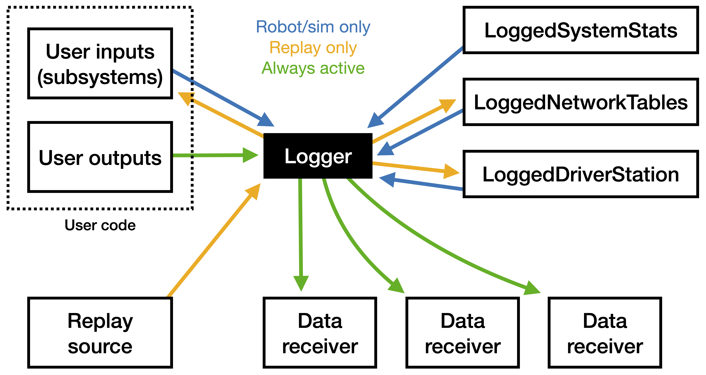

# Getting Started: Logging

## Background

A variety of logging frameworks already exist in FRC, from built-in tools like the Driver Station and Network Tables all the way to custom solutions for logging more detailed information. However, most systems exist around the same fundamental idea; record a limited set of values explicitly provided by the code. That could include sensor data, PID error, odometry pose, internal state, etc. While this had enormous value, it doesn't solve the eternal sentiment when something goes wrong: "If only we were logging this one extra field!"

Logging in AdvantageKit is built around a different principle, often used in industry. Instead of logging specific output values from the user code, it records *all of the data flowing into the robot code*. Every sensor value, joystick press, Network Tables update, and much more is logged every loop cycle. After a match, these values can be replayed to the robot code in a simulator. Since every input command is the same, all of the internal logic of the code is replayed exactly. This allows you to log extra fields after the fact, or add breakpoints and inspect the code line by line. This technique means that logging is more than just a tool for checking on specific issues; it's also a safety net that can be used to verify how any part of the code functions.

Logging in AdvantageKit is built with the following goals in mind:

* Support a high level of logging in way that is **accessible**. This menas reducing the changes required to user code as much as possible, and building on top of existing frameworks (like command-based WPILib).

* Provide **capable** and **easy-to-use** methods of viewing log data. The robot code saves logs in a custom binary format which is read by our viewer application [Advantage Scope](https://github.com/Mechanical-Advantage/AdvantageScope). Data can also be viewed live over the networkk.

* Maintain **openness** and **transparency** during development as part of 6328's efforts with the [#OpenAlliance](https://github.com/OpenAllianceFRC/info).

## Advantage Scope

You can download the latest version of Advantage Scope [here](https://github.com/Mechanical-Advantage/AdvantageScope/releases/latest) for Windows, macOS, and Linux. This application is required for viewing log files.


## Installation With Gradle

AdvantageKit is available through GitHub Packages. To make our Maven repository available through Gradle, add the following block to the `build.gradle` file:

```groovy
repositories {
    maven {
        url = uri("https://maven.pkg.github.com/Mechanical-Advantage/AdvantageKit")
        credentials {
            username = "Mechanical-Advantage-Bot"
            password = "ghp_ykO20iuCY5H2i" + "LgmNxz8VIKJ2uQa6g1DdV0i"
        }
    }
}
```

AdvantageKit modifies some components of `wpilibj` (see [our explanation](/docs/CONDUIT-SHIMS.md) for the purpose of these shims or the [list of modified classes](/junction/shims/wpilib#interface)). Add the following block to `build.gradle` to replace the default implementation. **This is required for the framework to function**

```groovy
configurations.all {
    exclude group: "edu.wpi.first.wpilibj"
}
```

To pull in the logging framework, go to "WPILib: Manage Vendor Libraries" > "Install new libraries (online)" and paste in the URL below. The changelog for the [latest release](https://github.com/Mechanical-Advantage/AdvantageKit/releases/latest)) includes the WPILib version on which it is based; we recommend using the same version in your robot project. You can check the selected version of WPILib at the top of the file to the right of "edu.wpi.first.GradleRIO".

```
https://raw.githubusercontent.com/Mechanical-Advantage/AdvantageKit/main/AdvantageKit.json
```

## Understanding Data Flow

`Logger` is the primary class managing data flow for the logging framework. It functions in two possible modes depending on the environment:
* **Real robot/simulator** - When running on a real robot (or a physics simulation, Romi, etc.), `Logger` reads data from the user program and built-in sources, then saves it to one or more targets (usually a log file).
* **Replay** - During this mode, which runs in the simulator, `Logger` reads data from an external source like a log file and writes it out to the user program. It then records the original data (plus any outputs from the user program) to a separate log file.



Below are definitions of each component:
* **User inputs** - Input data from hardware managed by the user program. This primarily includes input data to subsystem classes. See "Subsystems" below for how this component is implemented.
* **User outputs** - Data produced by the user program based on the current inputs (odometry, calculated voltages, internal states, etc.). This data can be reproduced during replay, so it's the primary method of debugging code based on a log file.
* **Replay source** - Provides data from an external source for use during replay. This almost always means reading data from a log file produced by the robot. A replay source only exists while in replay (never on the real robot).
* **Data receiver** - Saves data to an external source in all modes. Multiple data receivers can be provided (or none at all). While a data receiver usually writes to a log file, it can also be used to send data over the network.
* **LoggedSystemStats** *(Built-in input)* - Records robot stats like battery voltage, PDP current draw, and CAN bus utilization for diagnostics. This data is not available during replay.
* **LoggedNetworkTables** *(Built-in input)* - Records and replays data in Network Tables. This is primarily intended for data which is not time sensitive such as dashboard options and tuning values.
* **LoggedDriverStation** *(Built-in input)* - Internal class managing driver station data. See [here](/docs/CONDUIT-SHIMS.md) for details on why this data needs to be managed by the framework.

Data is stored based on string keys where slashes are used to denote subtables (similar to Network Tables) - each subsystem stores data in a separate subtable. A new set of data is produced for each cycle, meaning values are NOT persistent. If a key is not set during a cycle, its value will be `null` by default. The following data types are currently supported:

`boolean, boolean[], int, int[], double, double[], String, String[], byte, byte[]`

`Logger` is also responsible for manging timestamps. The current timestamp from the FPGA is read at the start of each cycle and syncronized for all logic. For example, calls to `Timer.getFPGATimestamp()` will return this syncronized timestamp. This system guarantees that control logic can be replayed accurately.

## Robot Configuration

The main `Robot` class must inherit from `LoggedRobot` (see below). `LoggedRobot` performs the same functions as `TimedRobot`, with some exceptions:

* It does not support adding extra periodic functions.
* The method `setUseTiming` allows the user code to disable periodic timing and run cycles as fast as possible during replay. The timestamp read by methods like `Timer.getFPGATimstamp()` will still match the timestamp from the real robot.

```java
public class Robot extends LoggedRobot {
    ...
}
```

The user program is responsible for configuring and intializing the logging framework. This setup should be placed in `robotInit()` *before any other initialization*. An example configuration is provided below:

```java
setUseTiming(isReal()); // Run as fast as possible during replay
LoggedNetworkTables.getInstance().addTable("/LiveWindow"); // Log & replay "LiveWindow" values (only "SmartDashboard" is logged by default).
Logger.getInstance().recordMetadata("ProjectName", "MyProject"); // Set a metadata value

if (isReal()) {
    Logger.getInstance().addDataReceiver(new ByteLogReceiver("/media/sda1/")); // Log to USB stick (name will be selected automatically)
    Logger.getInstance().addDataReceiver(new LogSocketServer(5800)); // Provide log data over the network, viewable in Advantage Scope.
} else {
    String path = ByteLogReplay.promptForPath(); // Prompt the user for a file path on the command line
    Logger.getInstance().setReplaySource(new ByteLogReplay(path)); // Read log file for replay
    Logger.getInstance().addDataReceiver(new ByteLogReceiver(ByteLogReceiver.addPathSuffix(path, "_sim"))); // Save replay results to a new log with the "_sim" suffix
}

Logger.getInstance().start(); // Start logging! No more data receivers, replay sources, or metadata values may be added.
```

This setup enters replay mode for all simulator runs. If you need to run the simulator without replay (e.g. a physics simulator or Romi), extra constants or selection logic is required.

Metadata can be a valuable tool for ensuring that a log is replayed on the same version of code which produced it. We use this [Gradle plugin](https://github.com/lessthanoptimal/gversion-plugin) to produce a constants file with information like the Git SHA and build date. These values can then be stored as metadata during setup.

## Subsystems

By necessity, any interaction with external hardware must be isolated such that all input data is logged and can be replayed in the simulator where that hardware it not present. For most robot code (such as command-based projects), hardware interaction occurs in multiple "subsystem" classes. Traditionally, a subsystem has three main components:


* The **public interface** consists of methods used by the rest of the robot code to control the subsystem.

* The **control logic** is the internal code used to follow those commands or analyze sensor data.

* The **hardware interface** is the code used to read sensors and directly control hardware like motors or pneumatics.

Data logging of inputs should occur between the control logic and hardware interface - this ensures that any control logic can be replayed in the simulator. We suggest restructuring the subsystem such that hardware interfacing occurs in a separate object (we call this the "IO" layer). The IO layer includes an interface defining all methods used for interacting with the hardware along with one or more implementations that make use of vendor libraries to carry out commands and read data.


*Refer to [this folder](https://github.com/Mechanical-Advantage/LoggingDevelopment/tree/master/src/main/java/frc/robot/subsystems/template) for some example IO interfaces and implementations.*

Outputs (setting voltage, setpoint, PID constants, etc.) make use of simple methods for each command. Input data is more controlled such that it can be logged and replayed. Each IO interface defines a class with public attributes for all input data ([example](https://github.com/Mechanical-Advantage/LoggingDevelopment/blob/master/src/main/java/frc/robot/subsystems/template/ClosedLoopIO.java#L13)), along with methods for saving and replaying that data from a log (`toLog` and `fromLog`). The IO layer then includes a single method (`updateInputs`) for updating all of that data. The subsystem class contains an instance of both the current IO implementation and the "inputs" object. Once per cycle, it updates the input data and sends it to the logging framework:

```java
io.updateInputs(inputs); // Update input data from the IO layer
Logger.getInstance().processInputs("ExampleSubsystem", inputs); // Send input data to the logging framework (or update from the log during replay)
```

The rest of the subsystem then reads data from this inputs object rather than directly from the IO layer. This structure ensures that:

* The logging framework has access to all of the data being logged and can insert data from the log during replay.

* Throughout each cycle, all code making use of the input data reads the same values - the cache is never updated *during a cycle*. This means that the data replayed from the log appears identical to the data read on the real robot.

All of the IO methods include a default implementation which is used during simulation. We suggest setting up each subsystem take the IO object as a constructor argument, so that the central robot class (like `RobotContainer`) can decide whether or not to use real hardware:

```java
public RobotContainer() {
    if (isReal()) {
        // Instantiate IO implementations to talk to real hardware
        driveTrain = new DriveTrain(DriveTrainIOReal());
        elevator = new Elevator(ElevatorIOReal());
        intake = new Intake(IntakeIOReal());
    } else {
        // Use anonymous classes to create "dummy" IO implementations
        driveTrain = new DriveTrain(DriveTrainIO() {});
        elevator = new Elevator(ElevatorIO() {});
        intake = new Intake(IntakeIO() {});
    }
}
```

> Note: We suggest use of an IO layer to minimize the chance of accidentally attempting to interact with hardware which doesn't exist. However, any structure will work where all input data flows through an inputs object implementing `LoggableInputs` and the two methods `fromLog` and `toLog`. Feel free to make use of whatever structure best fits your own requirements.

## Logging Outputs

Output data consists of any calculated values which could be recreated in the simulator, including...

* Odometry pose

* Motor voltages

* Pneumatics commands

* Status data for drivers

* Internal object state

The logging framework supports recording this output data on the real robot and during replay. Essential data like the odometry pose are recorded on the real robot for convenience; even if it can be recreated in a simulator, that's often not a viable option in the rush to fix a problem between matches. During replay, recording extra output data is the primary method of debugging the code - logging calls can be added anywhere as they don't interfere with the replayed control logic. Any loggable data type (see above) can be saved as an output like so:

```java
Logger.getInstance().recordOutput("Odometry/XMeters", pose.getX());
Logger.getInstance().recordOutput("Odometry/YMeters", pose.getX());
Logger.getInstance().recordOutput("Odometry/RotationRadians", pose.getRotation().getRadians());
```

Remember that unlike Network Tables, **logged data is not persistent**. These fields must be logged every cycle in order to remain visible. This data is automatically saved to the `RealOutputs` or `ReplayOutputs` table, and it can be divided further into subtables using slashes (as seen above).

## Restrictions

Unless otherwise specified, all normal WPILib and vendordep features will function correctly under the logging framework. See a list of exceptions below:

* As explained in the "Subsystems" section, all hardware interaction must be isolated from the main control logic. This includes all motors, pneumatics, external sensors, vision processing, and robot status not controlled by the `DriverStation` class (including battery voltage, brownout status, and current draw from the PDP).

* All user code must be single threaded. This is necessary to ensure that logged data is recorded and replayed predictably, and the timing of extra threads cannot be recreated in a simulator. 

In addition, the logging framework typically increases the length of each loop cycle by 2-3ms. See [this page](CONDUIT-SHIMS.md) for more details. We recommend using the performance data automatically saved under `RealOutputs/LoggedRobot` to check if your code is at risk of causing loop overruns. In particular, recording Network Tables data is often performance intensive - you may need to reduce the number of logged NT subtables where possible.