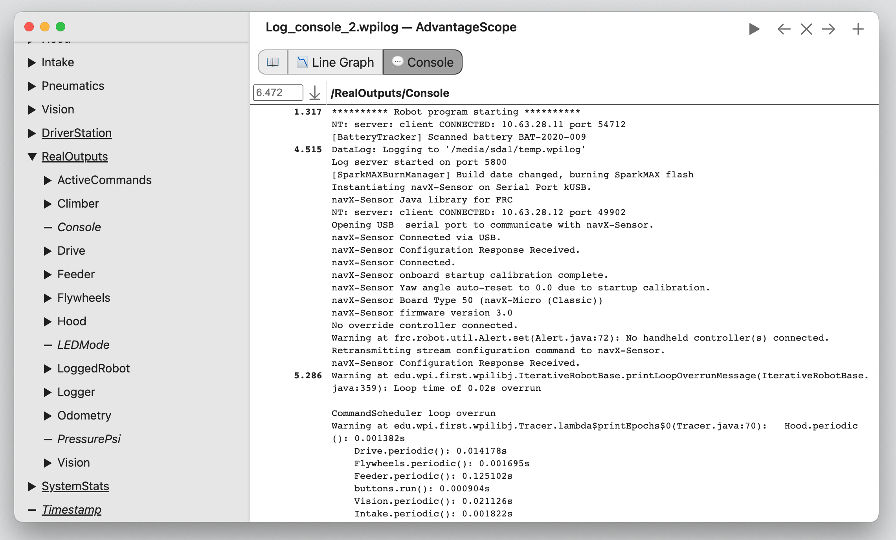

# Built-In Logging

AdvantageKit automatically logs many important fields as inputs or outputs. No configuration is required to use these features.

:::info
Built-in input values are available during replay with guaranteed accuracy and can be freely accessed in user code without manual logging. **All other inputs must be logged using an [IO interface](./recording-inputs/io-interfaces.md).**
:::

## Inputs

### Timestamp

AdvantageKit logs and replays the value of `RobotController.getTime()`, `Timer.getTimestamp()`, etc. See [this page](./deterministic-timestamps.md) for more details on timestamps in AdvantageKit.

:::warning
The methods `RobotController.getFPGATime()` and `Timer.getFPGATimestamp()` are used for accessing the real (non-deterministic) timestamp, and should only be used within IO implementations or for performance profiling.
:::

### Driver Station

All values that can be accessed via the `DriverStation` or WPILib HID classes (`Joystick`, `XboxController`, etc) are automatically logged and replayed. These fields are available under the `DriverStation` table.

### Dashboard Inputs

Dashboard inputs accessed **via AdvantageKit dashboard classes** are automatically logged and replayed. See [this page](./recording-inputs/dashboard-inputs.md) for details. These fields are available under the `NetworkInputs` table.

## Outputs

### Alerts

The state of any alerts created through WPILib's [persistent alerts](https://docs.wpilib.org/en/latest/docs/software/telemetry/persistent-alerts.html) API will be automatically logged as outputs. These alerts can be visualized using AdvantageScope's 📉 [Line Graph](https://docs.advantagescope.org/tab-reference/line-graph) tab. These fields are available under the `RealOutputs` or `ReplayOutputs` table.

### Console

Console output is automatically logged by AdvantageKit to the `Console` field, and can be viewed using AdvantageScope's 💬 [Console](https://docs.advantagescope.org/tab-reference/console) tab. This field is available under the `RealOutputs` or `ReplayOutputs` table.

:::info
Output from native code is not included when running in simulation.
:::

### Radio Status

Status data from the VH-109 radio is automatically logged every ~5 seconds. This includes useful information about the connection status, bandwidth usage, etc. These fields are available under the `RadioStatus` table.

### Power Distribution Data

The current on each channel, along with other useful stats, are automatically logged by AdvantageKit as outputs. The `LoggedPowerDistribution` class can be used to configure this behavior, such as manually setting the Power Distribution CAN ID. These fields are available under the `PowerDistribution` table.

:::warning
This feature is only supported on Power Distribution devices that support current monitoring (the CTRE PDP and REV PDH). The CTRE PDP 2.0 is **not supported**.
:::

### System Stats

Important status information from the roboRIO is automatically recorded, such as the battery voltage, rail status, CAN status, and system time. These fields are available under the `SystemStats` table.

### Performance Data

Several important fields are automatically recorded to measure the performance of the robot code:

- `LoggedRobot/FullCycleMS`: The execution time of all periodic code, should be less than the loop period (20ms by default).
- `LoggedRobot/UserCodeMs`: The execution time of all user periodic code.
- `LoggedRobot/LogPeriodicMS`: The execution time of all AdvantageKit periodic code.
- `LoggedRobot/GCTimeMS`: The total execution time of the Java garbage collector within the last loop cycle, may or may not overlap with other code execution.
- `LoggedRobot/GCCount`: The total number of collections performed by the Java garbage collector within the last loop cycle.
- `Logger/QueuedCycle`: The number of cycles of data in queue to be written to data receivers.
- `Logger/...MS`: The execution time of each step of the AdvantageKit periodic code.
