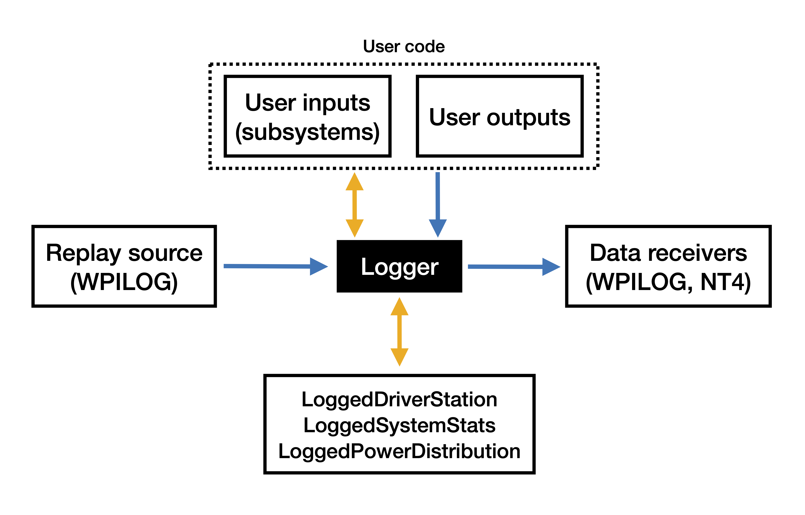

# Data Flow

`Logger` is the primary class managing data flow for AdvantageKit. It functions in two possible modes depending on the environment:

- **Real robot/simulator** - When running on a real robot (or a physics simulation, Romi, etc.), `Logger` reads data from the user program and built-in sources, then saves it to one or more targets (usually a log file).
- **Replay** - During this mode, which runs in the simulator, `Logger` reads data from an external source like a log file and writes it out to the user program. It then records the original data (plus any outputs from the user program) to a separate log file.

## Components

Below are definitions of each component:

- **User inputs** - Input data from hardware managed by the user program. This primarily includes input data to subsystem classes. See [Recording Inputs](/recording-inputs/io-interfaces) for details about how this component is implemented.
- **User outputs** - Data produced by the user program based on the current inputs (odometry, calculated voltages, internal states, etc.). This data can be reproduced during replay, so it's the primary method of debugging code based on a log file. See [Recording Outputs](/recording-outputs) for details about how this component is implemented.
- **Replay source** - Provides data from an external source for use during replay. This usually means reading data from a log file produced by the robot. A replay source only exists while in replay (never on the real robot).
- **Data receiver** - Saves data to an external source in all modes. Multiple data receivers can be provided (or none at all). While data receivers can to a log file or send data over the network.
- **LoggedDriverStation** _(Built-in input)_ - Internal class for recording and replaying driver station data (enabled state, joystick data, alliance color, etc).
- **LoggedSystemStats** _(Built-in input)_ - Internal class for recording and replaying data from the roboRIO (battery voltage, rail status, CAN status).
- **LoggedPowerDistribution** _(Built-in input)_ - Internal class for recording and replaying data from the PDP or PDH (channel currents, faults, etc).
