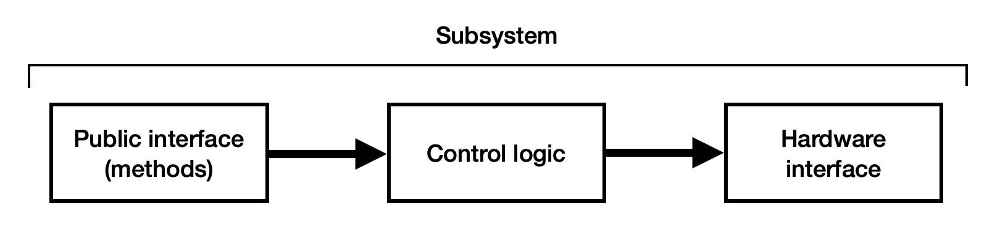
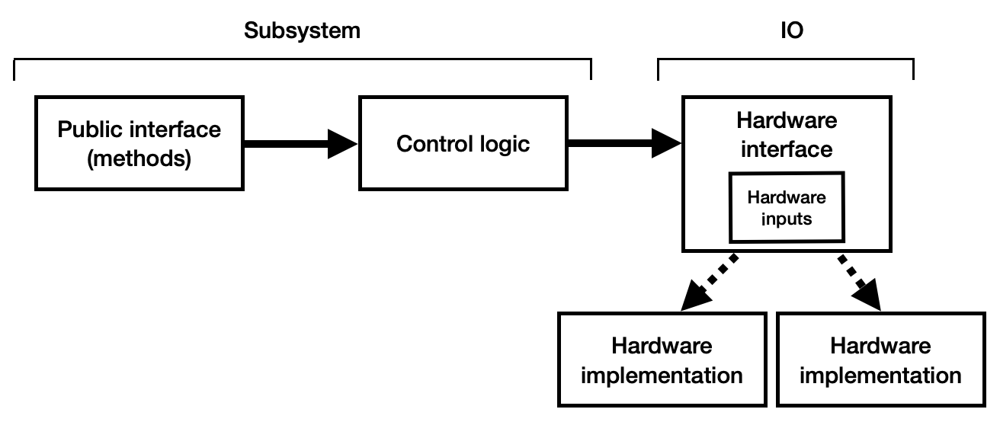

# IO Interfaces

By necessity, any interaction with external hardware must be isolated such that all input data is logged and can be replayed in the simulator where that hardware is not present. Most hardware interaction occurs in subsystem classes (read [this section](./dashboard-inputs) for information on using NetworkTables as an input). Traditionally, a subsystem has three main components:



- The **public interface** consists of methods used by the rest of the robot code to control the subsystem.

- The **control logic** is the internal code used to follow those commands or analyze sensor data.

- The **hardware interface** is the code used to read sensors and directly control hardware like motors or pneumatics.

Data logging of inputs should occur between the control logic and hardware interface - this ensures that any control logic can be replayed in the simulator. We suggest restructuring the subsystem such that hardware interfacing occurs in a separate object (we call this the "IO" layer). The IO layer includes an interface defining all methods used for interacting with the hardware along with one or more implementations that make use of vendor libraries to carry out commands and read data.



:::tip
Refer to the [AdvantageKit templates](/category/template-projects) for some reference IO interfaces and implementations.
:::

Outputs (setting voltage, setpoint, PID constants, etc.) make use of simple methods for each command. Input data is more controlled such that it can be logged and replayed. Each IO interface defines a class with public attributes for all input data, along with methods for saving and replaying that data from a log (`toLog` and `fromLog`). We recommend using the [`@AutoLog`](/data-flow/recording-inputs/annotation-logging) annotation to generate these methods automatically.

The IO layer includes a single method (`updateInputs`) for updating all of the input data. The subsystem class contains an instance of both the current IO implementation and the "inputs" object. Once per cycle, it updates the input data and sends it to the logging framework:

```java
io.updateInputs(inputs); // Update input data from the IO layer
Logger.processInputs("ExampleSubsystem", inputs); // Send input data to the logging framework (or update from the log during replay)
```

The rest of the subsystem then reads data from this inputs object rather than directly from the IO layer. This structure ensures that:

- The logging framework has access to all of the data being logged and can insert data from the log during replay.
- Throughout each cycle, all code making use of the input data reads the same values - the cache is never updated _during a cycle_. This means that the data replayed from the log appears identical to the data read on the real robot.

All of the IO methods include a default implementation which is used during simulation. We suggest setting up each subsystem accept the IO object as a constructor argument, so that the central robot class (like `RobotContainer`) can decide whether or not to use real hardware:

```java
public RobotContainer() {
    if (isReal()) {
        // Instantiate IO implementations to talk to real hardware
        driveTrain = new DriveTrain(new DriveTrainIOReal());
        elevator = new Elevator(new ElevatorIOReal());
        intake = new Intake(new IntakeIOReal());
    } else {
        // Use anonymous classes to create "dummy" IO implementations
        driveTrain = new DriveTrain(new DriveTrainIO() {});
        elevator = new Elevator(new ElevatorIO() {});
        intake = new Intake(new IntakeIO() {});
    }
}
```

:::tip
We suggest the use of an IO layer to minimize the chance of interacting with hardware that doesn't exist. However, any structure will work where all input data flows through an inputs object implementing `LoggableInputs` and the two methods `fromLog` and `toLog`. Feel free to make use of whatever structure best fits your own requirements.
:::
