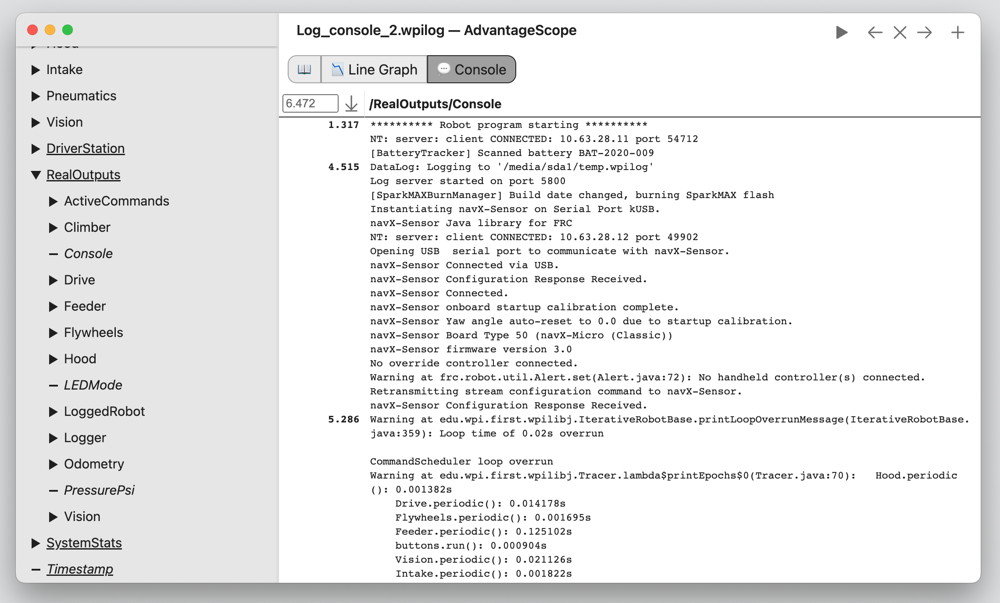

# Console Capture

Console output is automatically logged by AdvantageKit to the "Console" field, and can be viewed using AdvantageScope's 💬 [Console](https://docs.advantagescope.org/tab-reference/console) tab. Note that output from native code is not included when running in simulation.

