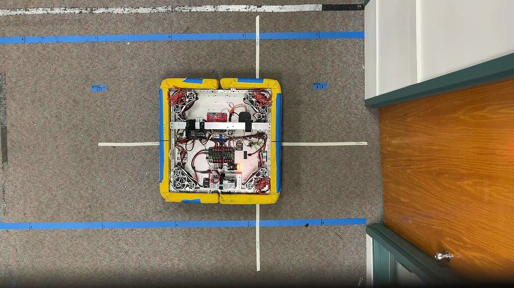

import Results from "./img/high-freq-odometry-3.webp";

# High-Frequency Odometry

The AdvantageKit swerve templates support high-frequency odometry on both Spark and TalonFX(S) hardware, which means that data from the drive motors, encoders, and gyro are sampled _faster_ than the primary 50 Hz loop cycle. The purpose of high-frequency odometry is to improve the accuracy and consistency of odometry data.

The testing below was conducted by Team 6328 in November 2023 to measure the benefit of high-frequency odometry compared to traditional 50 Hz odometry. Note that this data is broadly applicable to any application of this technique, not just the AdvantageKit templates. This testing builds on the work done by CTRE [here](https://pro.docs.ctr-electronics.com/en/latest/docs/application-notes/update-frequency-impact.html#practical-results), which was performed under inconsistent testing conditions with a very small sample size.

## Setup

We focused our testing on the accuracy of odometry during an autonomous path with no vision assistance. This is where the accuracy of wheel odometry is most critical — during teleop, additional sensors like vision will _always_ be necessary to maintain accuracy.

Using a NEO-based swerve, we ran a ~12 second PathPlanner auto as shown below. This is intended to be representative of the type of movement that might be seen during an auto path, including holonomic rotations, movement in multiple directions, and occasional hard accelerations.

The start location of the auto is marked with the large white cross, and the robot was commanded to return to the same position. Log data shows that the robot's odometry always reached the target with negligible error. Using a camera positioned in the ceiling, we are able to estimate the robot’s true ending position based on a tape marker at the center of the robot (example shown below). Any error from the target position to the robot’s position represents odometry error that was accumulated during the path.

## Results

We repeated this auto 16 times — 8 times with 50Hz odometry and 8 times with 250Hz odometry. The ending positions are plotted below in meters, where blue is 50Hz and orange in 250Hz. The dark circles represent the average ending position of each set of samples.

The mean error and standard deviations are shown below. Note that the improvement in mean error was relatively small compared to the improvement in standard deviation. In practice, this means that **autos are unlikely to be more accurate, but they will be much more consistent/precise.**

|               | Mean Error (m) | Standard Deviation (m) |
| ------------- | -------------- | ---------------------- |
| 50Hz          | 0.388          | 0.180                  |
| 250Hz         | 0.297          | 0.028                  |
| % Improvement | 23.3%          | 84.4%                  |

## CANivore Timesync

The TalonFX(S) swerve template for AdvantageKit supports [CANivore Timesync](https://pro.docs.ctr-electronics.com/en/latest/docs/api-reference/api-usage/status-signals.html#canivore-timesync) for Phoenix Pro subscribers running the drive on a [CANivore](https://pro.docs.ctr-electronics.com/en/latest/docs/canivore/canivore-intro.html). CTRE conducted testing on the impact of timesync on odometry accuracy, which can be found [here](https://pro.docs.ctr-electronics.com/en/latest/docs/application-notes/update-frequency-impact.html#after-test-data). This part of CTRE's testing was based on a more reliable testing methodology than the rest of the linked page, using autonomous driving similar to the approach described here.

They found an improvement in error of ~15% and in standard deviation of ~34%. This is a measurable but relatively modest improvement compared to high-frequency odometry, and similarly has a more significant impact on _consistency_ (standard deviation) than overall _accuracy_ (error).
