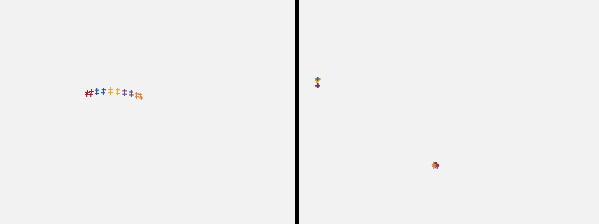
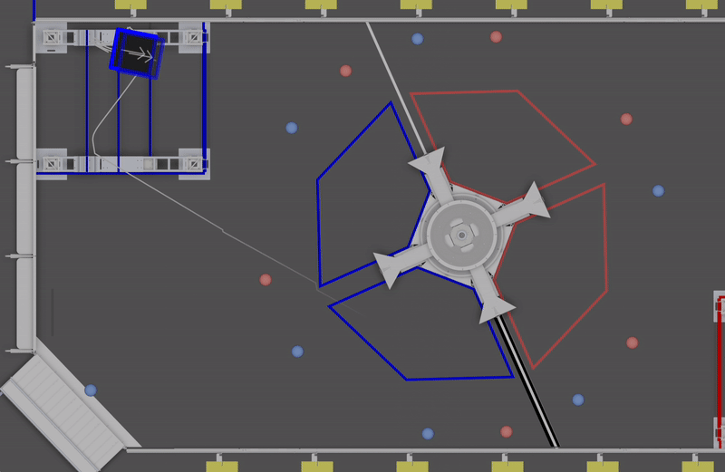

# Replay Example: Bug Fixes

In addition to analyzing the robot code's behavior, we can also use replay to test improvements. 6328's 2022 robot used vision data from a Limelight to reset its odometry (calculated position on the field). This involves a complex pipeline in the robot code, and filtering invalid targets is critical. Below is a clip showing the robot's odometry during a particularly problematic moment. The green line indicates when vision data is being used to reset the position.


This movement is clearly impossible. Note that the Limelight on the robot is facing backward, and couldn't possibly have detected the target at the center of the field when the position initially jumps across the field. Let's use the log data to dig deeper. The vision pipeline is based on the four detected corners of each piece of vision tape around the target. Plotting these points, we would expect to see a smooth curve like the image on the left. There are five pieces of tape with distinct corners. Instead, during this moment in the log, we see the points to the right.



The Limelight isn't seeing the vision tape, so the corners are inaccurate. In fact, many of the targets it reports don't even have four corners! To improve the filtering, let's **check that the number of reported corners is divisible by four**:

```java
if (inputs.cornerX.length % 4 == 0 && inputs.cornerX.length == inputs.cornerY.length) {
    // Data looks good, continue processing
} else {
    // Bad data, discard this frame
}
```

After making this change, we run the code in replay and check the "ReplayOutputs". Unlike the first example, we've modified the original code and would expect the odometry to be different in replay. Here's the same clip as before, with the translucent robot representing the robot pose in replay:



The adjusted code now properly rejects the invalid target and accepts the valid one (notice that real and replay poses converge when the robot is pointed toward the real target). We can now run this code in future matches with confidence, because we know exactly what the code _would have done if this new version was running on the field._
