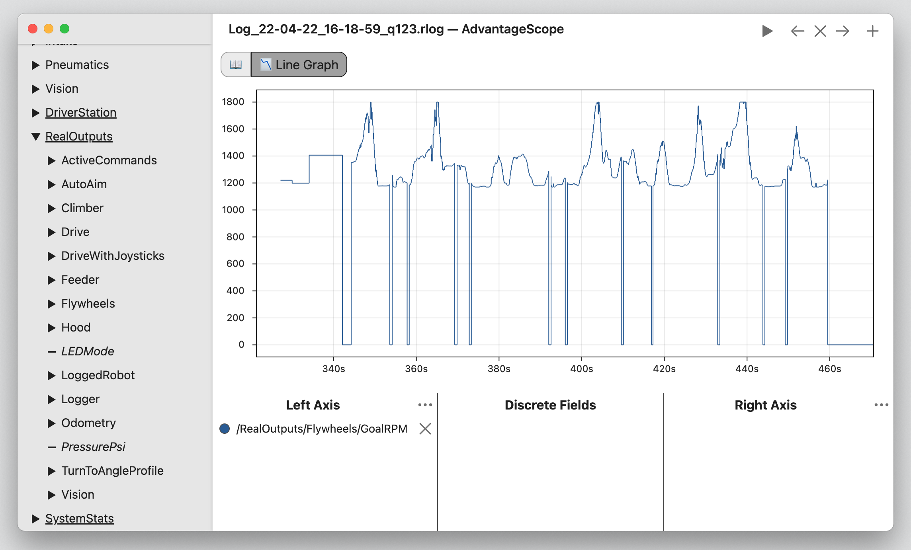

# Replay Example: Output Logging

Let's look at a concrete example of AdvantageKit in action. Below is a plot from 6328's 2022 robot, based on an AdvantageKit log file. It shows the flywheel's setpoint speed during a match.



During teleop, this speed is based on the distance between the robot and the target. We might want to check that the flywheel speed calculation is working correctly, but this log doesn't include the calculated distance that was used. **Let's use AdvantageKit to replay the log and produce this new data.**

First, we need to run the replay using the same version of the code that generated this log. AdvantageKit can save metadata with the log file, and we've already stored the Git hash (uniquely identifying the version of code that was running on the robot):


Next, we can return to the correct commit using git (`git checkout ab12cf`...) and add the following line to the odometry subsystem:

```java
Logger.recordOutput("TargetDistanceMeters", latestPose.getTranslation().getDistance(FieldConstants.hubCenter));
```

This line doesn't change the behavior of the robot code, but it logs extra "output" data every cycle. Recall that because...

- The **same code** is running on the robot and in the simulator AND...
- AdvantageKit will provide the **same inputs** to the simulator that occurred on the real robot...

...the outputs from the line we added are the same as if we were logging this data on the real robot. When we start the simulator, AdvantageKit loads the log file and replays the loop cycles as quickly as possible (most laptops are much faster than the roboRIO):


AdvantageKit produced a new log file, which includes all of the data from the original plus a new "ReplayOutputs" table. All of these outputs match their counterparts in "RealOutputs" (logged by the robot on the field). For example, the odometry data (robot pose) was identical in replay:


The "ReplayOutputs" also includes our new field "TargetDistanceMeters". We can confirm that the flywheel setpoint is increasing along with distance, so the calculation is working correctly. Using replay, we're able to make that conclusion with complete certainty even though we're _using data that was never logged by the robot on the field._


