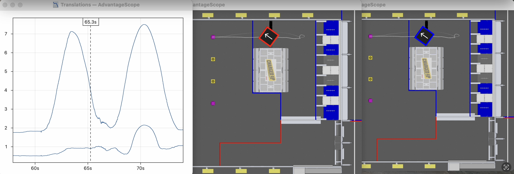
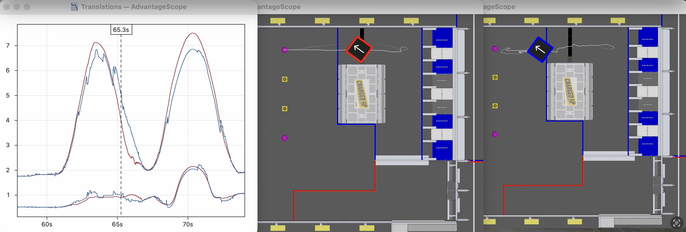
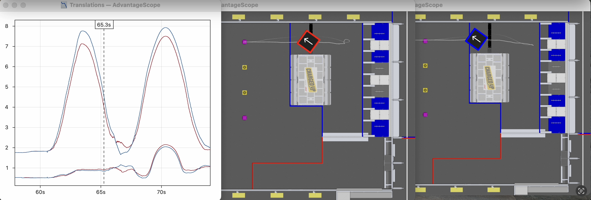

# Replay Example: Rapid Iteration

Some uses cases of log replay benefit from rapid iteration. One such example is tuning pose estimation algorithms. WPILib's [built-in pose estimators](https://docs.wpilib.org/en/stable/docs/software/advanced-controls/state-space/state-space-pose-estimators.html) include gains that adjust the trust in odometry and vision values. Adjusting these gains affects the stability and responsiveness of the pose estimates, but accurate testing requires real-world conditions (since the algorithm needs to be tuned to deal with the noise of real match conditions).

AdvantageKit includes a feature called [replay watch](../replay-watch.md) which is intended to address use cases that benefit from rapid iteration. The task is launched in the background, and then changes to the code are immediately replayed and displayed in AdvantageScope.

The video below demonstrates how vision standard deviations (trust values) can be tuned in replay based on the output of the pose estimator. The original outputs are shown in red, and the replayed outputs are shown in blue.

<iframe width="100%" style={{"aspect-ratio": "2708 / 1748"}} src="https://www.youtube.com/embed/HQy6cZAfJL0" title="AdvantageKit Replay Watch Demo (Pose Estimation)" frameborder="0" allow="accelerometer; autoplay; clipboard-write; encrypted-media; gyroscope; picture-in-picture; web-share" referrerpolicy="strict-origin-when-cross-origin" allowfullscreen></iframe>

:::note
The replay process shown in the video is in running in real-time. The replay duration depends on the size of the log file, complexity of robot project, and CPU performance of the development computer.
:::

Several versions of the vision gains are tested in the video:

- **Normal trust in vision** produces identical outputs to the original pose estimates, which validates that deterministic replay is working correctly.

- **High trust in vision** produces more responsive but much noisier pose estimates.

- **Low trust in vision** produces stabler but less responsive pose estimates, incorrectly showing the robot pass beyond the purple game piece in the middle of the field.

