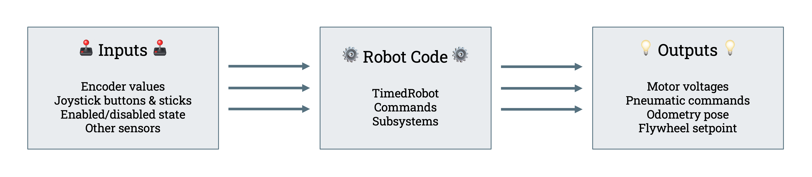
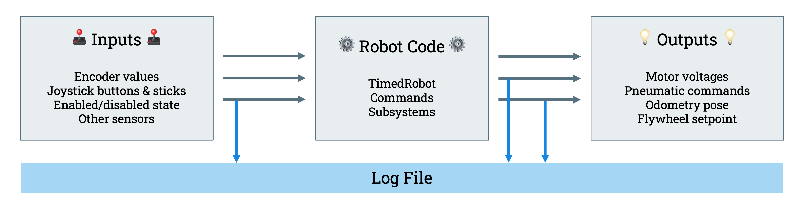

# What is AdvantageKit?

AdvantageKit is a logging framework. But to understand it, we need to start by looking at FRC robot code in general. Here's what all robot code fundamentally looks like:

There are **inputs** like sensors and driver inputs and **outputs** like motor commands and other calculated values. The task of the **robot code** is to convert **inputs** into **outputs**.

A variety of logging frameworks already exist in FRC, from built-in tools like the Driver Station and [WPILib logging](https://docs.wpilib.org/en/stable/docs/software/telemetry/datalog.html) all the way to fully custom solutions. Most of these frameworks follow a similar structure, which looks this:

A limited set of values are provided by the robot code and stored in the log. That could include sensor data, PID error, odometry pose, output commands, etc. While this has enormous value, it doesn't solve the eternal sentiment when something goes wrong: "If only we were logging one extra field!" Notice above that there is data flowing in and out of the robot code without being saved to the log file.

AdvantageKit takes a different approach. This is what logging looks like with AdvantageKit:

Instead of logging a limited set of values from the user code, AdvantageKit records _all of the data flowing into the robot code_. Every sensor value, button press, and much more is logged every loop cycle. After a match, these values can be replayed to the robot code in a simulator. Since every input command is the same, all of the internal logic of the code is replayed exactly. This allows you to log extra fields after the fact, or modify pipelines to see how they _would have_ functioned during the match. This technique means that logging is more than just a tool for checking on specific issues; it's also a safety net that can be used to verify how any part of the code functions.
