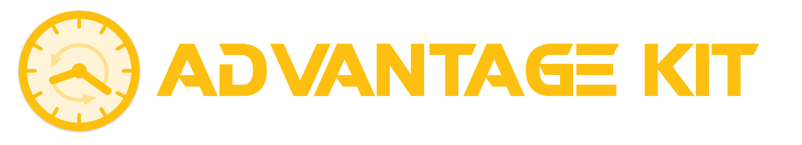

import DocCardList from "@theme/DocCardList";

#

AdvantageKit is a logging, telemetry, and replay framework developed by [Team 6328](https://littletonrobotics.org). AdvantageKit enables **log replay**, where the full state of the robot code can be replayed in simulation based on a log file ([What is AdvantageKit?](/getting-started/what-is-advantagekit)). See also:

- [AdvantageScope](https://docs.advantagescope.org), our robot telemetry application which **does not require AdvantageKit to use**.
- [WPILib Data Logging](https://docs.wpilib.org/en/stable/docs/software/telemetry/datalog.html), a simpler logging system included in WPILib (does not support log replay in simulation, but covers the needs of most teams).

<DocCardList
items={[
{
type: "category",
label: "What is AdvantageKit?",
href: "/getting-started/what-is-advantagekit"
},
{
type: "category",
label: "Installation",
href: "/getting-started/installation"
},
{
type: "category",
label: "Template Projects",
href: "/category/template-projects"
},
{
type: "category",
label: "Supported Types",
href: "/data-flow/supported-types"
},
{
type: "category",
label: "Recording Inputs",
href: "/category/recording-inputs"
},
{
type: "category",
label: "Recording Outputs",
href: "/data-flow/recording-outputs/"
},
{
type: "category",
label: "Common Issues",
href: "/category/common-issues"
},
{
type: "category",
label: "SysId Compatibility",
href: "/data-flow/sysid-compatibility"
}
]}
/>

Feedback, feature requests, and bug reports are welcome on the [issues page](https://github.com/Mechanical-Advantage/AdvantageKit/issues). For non-public inquires, please send a message to software@team6328.org.
