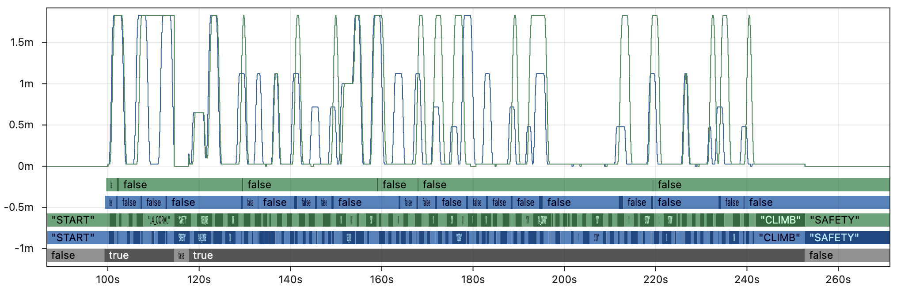
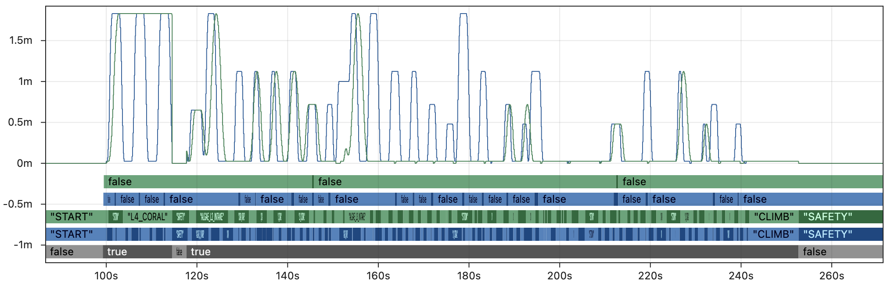
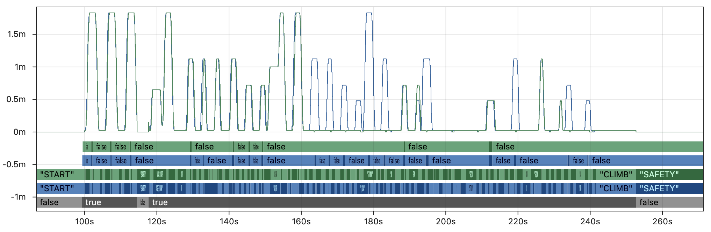
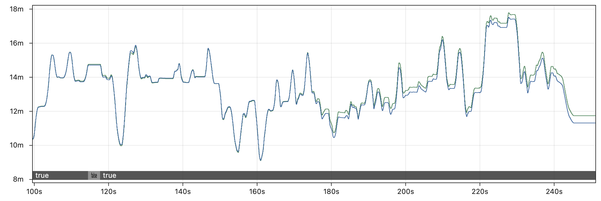

# 🦉 Hoot Replay Comparison

FRC teams have access to multiple logging tools that feature "replay" capabilities. The two primary options that teams might consider are [AdvantageKit](/getting-started/what-is-advantagekit/) and [Hoot Replay](https://v6.docs.ctr-electronics.com/en/latest/docs/api-reference/api-usage/hoot-replay.html), but each offers significantly different capabilities with regard to determinism, playback functionality, and code structure. This page compares these tools to help teams understand their key differences.

:::note
Many non-replay logging options are also available (such as [WPILib data logging](https://docs.wpilib.org/en/stable/docs/software/telemetry/datalog.html) and [Epilogue](https://docs.wpilib.org/en/stable/docs/software/telemetry/robot-telemetry-with-annotations.html)), but this page focuses exclusively on replay-compatible logging tools.
:::

## 🦋 Determinism

The biggest difference between Hoot Replay and AdvantageKit is **determinism**, the ability of each tool to replay robot code logic in a way that is **consistent, trustworthy, and robust to timing inconsistency**.

| AdvantageKit (Deterministic)                                                                                                                                                                      | Hoot Replay (Non-Deterministic)                                                                                                                                                                                                |
| ------------------------------------------------------------------------------------------------------------------------------------------------------------------------------------------------- | ------------------------------------------------------------------------------------------------------------------------------------------------------------------------------------------------------------------------------ |
| AdvantageKit guarantees that the replayed robot code will always match the behavior of the real robot. The results of replay can be trusted completely to match the actual behavior of the robot. | Hoot Replay makes no guarantees about the accuracy of replay in simulation. Data may arrive in replay at different times or at different rates than the real robot, which impacts the accuracy of all parts of the robot code. |

Determinism has a major impact on the practicality of log replay, since running simulation [faster than real-time](#-rapid-iteration) is a core part of the debugging process in practice. The accuracy of deterministic replay (AdvantageKit) is unaffected by replay speed, while the accuracy of non-deterministic replay (Hoot Replay) decreases when running at faster rates.

### Why Does It Matter?

We are often asked by teams why they should care about deterministic replay. Non-deterministic replay creates butterfly effects that severely impact the accuracy of replay.

The Butterfly Effect

The [butterfly effect](https://en.wikipedia.org/wiki/Butterfly_effect) describes how small differences in the inputs to a complex system (like robot code) have ripple effects that can significantly impact the system's behavior in the future. Minor differences in inputs can have a much larger effect on outputs than one might intuitively expect.

The sequence below provides a simple example of how non-deterministic inputs can impact important parts of the robot code:

1. A vision measurement from a camera is lost or delayed due to non-deterministic replay.
2. When combined with odometry data in a pose estimator, the estimated pose of the robot is incorrect for one or more loop cycles.
3. An auto-align command waits for the robot to be within tolerance before scoring. This is a precise operation where errors of less than a centimeter can have a major impact.
4. The driver presses a button to score just after the real robot is within tolerance. Since the replayed robot's pose is inaccurate, the auto-score command rejects the button input in replay (even though it was accepted on the real robot).
5. The superstructure of the robot is now being commanded to a different state on the real robot and in replay, since only the real robot continues the scoring operation.
6. Setpoints to individual mechanisms are now _drastically_ different between the real robot and replay, and do not match the inputs (e.g. encoders) provided to replay. Any tolerance checking of mechanisms is likely to be nonfunctional for the rest of the replay.
7. Future control inputs will not be correctly obeyed in replay, since the states of many commands and subsystems no longer match the real robot.

This scenario may seem specific, but similar divergences are **almost inevitable** when replaying robot code of moderate complexity. The testing in the next section demonstrates what this effect looks like in practice.

To demonstrate the impact of deterministic replay, we replayed a real log file from Team 6328's 2025 robot using AdvantageKit's deterministic replay (running ~50x faster than real-time) and a simulation of Hoot Replay.

First, the image below shows a few key fields from the AdvantageKit replay. The outputs from the real robot are in blue 🔵 and the outputs from AdvantageKit replay are in yellow 🟡. The line graph shows the commanded setpoint of the elevator. From bottom to top, the discrete fields show the enabled state, superstructure state, and whether the robot is in tolerance for scoring. Every field displayed here is an **exact match between real and replay**, providing complete trust in the accuracy of the data.

By contrast, the image below shows the same fields with simulated Hoot Replay running 5x faster than real-time. This is still about 10x _slower_ than AdvantageKit and largely impractical for real debugging workflows. The example shown here is also a _best case scenario_ which includes extensive modifications to the code that compensate for the difference in replay speed.

The outputs from the real robot are in blue 🔵 and the outputs from simulated Hoot Replay are in green 🟢. Within a _few seconds_ of starting the autonomous routine, the state of the robot has **completely diverged between real and replay** due to the butterfly effect. This significantly reduces the value of the log data for debugging, as it no longer resembles the original behavior.

Keep in mind that replayed outputs are most useful when the equivalent values were not recorded by the real robot (i.e. there is no reference point to verify accuracy). For that critical use case, there is _no way to distinguish accurate outputs_ from the inaccurate, diverged outputs shown above. This undermines the core purpose of replay, as the outputs cannot be trusted for debugging.

More Details

The graph of Hoot Replay above shows the results of replaying 5x faster than real-time with additional modifications to compensate for loop cycle time (these changes would not be part of a typical robot project). We have provided several other test cases to demonstrate the impact of different replay settings:

**5x faster than real-time, typical robot project:**

**2x faster than real-time, typical robot project:**

**2x faster than real-time, compensated:**

Note that even the _very best case_ shown in the last graph still breaks down completely midway through the match, and is unable to replay critical fields like the auto scoring tolerance.

**What about other fields?**

It is true that some fields are more affected by replay inaccuracy than others. For example, the graph below compares the X position of drive odometry between the real robot and Hoot Replay running 5x faster than real-time. Odometry is only affected by the drive motors, so it is less subject to the butterfly effect than other parts of the code (though it still drifts several feet by the end of the match).

Log replay is most helpful when untangling complex code logic that is nontrivial to recreate without the full set of input data, as demonstrated even in our [simplest examples](/getting-started/what-is-advantagekit/example-output-logging). Odometry data and other trivial fields serve as a partial exception to the butterfly effect, but (as noted above) the lack of reference points when running replay in practice means that it is never possible to distinguish non-deterministic outputs that are _slightly inaccurate_ (odometry) from the majority of outputs that are _completely inaccurate_.

**What about skipping in time?**

The [section below](#-rapid-iteration) explains why rapid iteration and running faster than real-time are critical to any replay workflow, which is why the examples above demonstrate the impact of running Hoot Replay faster than real-time. However, one might reasonably ask whether it is possible to simply start the replay at a later point in the log file.

The graph below demonstrates why this approach is ineffective, by skipping to the middle of teleop before running simulated Hoot Replay (2x faster than real-time with loop cycle compensation). Even in this best-case scenario for Hoot Replay running at only 2x speed, the replay is completely unable to match the real outputs. Skipping large parts of the log massively increases the impact of the butterfly effect by completely changing the set of inputs accessible to the replayed code. One should not expect to see accurate outputs at any speed unless all of the inputs are accounted for during replay.

## 💨 Rapid Iteration

Log replay can be used in a variety of environments, which take advantage of the ability to rapidly iterate on code or debug issues without access to the robot. Here are a few examples where replay can play a critical role in the debugging process:

- Debugging complex logic issues between matches without access to a practice field.
- Retuning an auto-score tolerance in the pits based on data from the last match.
- Testing a variety of vision filtering techniques between in-person meetings.
- Remotely debugging issues for a team by repeatedly logging additional outputs.
- Generating outputs after every match that are too complex to run on the RoboRIO.

Every one of these use cases **depends on being able to run replay faster than real-time**. A typical match log may be 10 minutes long, and a replay feature that takes 10 minutes to run is not practical in any of these scenarios. Whether log replay is used under time pressure at an event or at home for rapid debugging, quickly running multiple replays with different outputs or tuning parameters is absolutely core to its utility.

### Comparison

| AdvantageKit                                                        | Hoot Replay                                        |
| ------------------------------------------------------------------- | -------------------------------------------------- |
| ✅ Run as fast as possible (e.g. ~50x real-time)                    | ❌ Accuracy decreases with faster speeds           |
| ✅ [Replay Watch](/getting-started/replay-watch) for fast iteration | ❌ Replay process is fully manual                  |
| ✅ Pull and push logs directly to AdvantageScope                    | ❌ Manual file management, multiple logs per match |

AdvantageKit's deterministic approach means that accuracy is unaffected by the replay speed. Running replay ~50 times faster than real-time is common, which means that **a 10 minute match log can be replayed in just _12 seconds_**. AdvantageKit is designed to make rapid iteration as painless as possible through features like [Replay Watch](/getting-started/replay-watch) and integration with AdvantageScope; just open a log, run replay, and see the results with _no manual log management required_.

By contrast, Hoot Replay's non-deterministic approach presents users with difficult trade-offs between accuracy and practicality. Running at just 5x speed already has a **[major impact](#why-does-it-matter) on accuracy while still taking a full _2 minutes_** per replay iteration. Non-determinism makes replay more difficult to use in the high-pressure scenarios where it matters the most.

## 🧱 Code Structure

While Hoot Replay involves significant trade-offs, its core design goal is to "simplify" hardware interactions. Unlike AdvantageKit, some subsystems may be compatible with Hoot Replay while using CTRE's standard subsystem structure (combining high-level logic, hardware configuration, low-level controls, and simulation in a single class).

Subsystems under Hoot Replay fall into the two categories shown below. Note that users must select a **single CAN bus** to replay, which means that many subsystems using entirely CTRE devices are not natively compatible with Hoot Replay. For subsystems that are not natively compatible, **every input must be manually logged and replayed**.

| **Natively Compatible**                                | **Manual Logging**                                                                                                                                                                                             |
| ------------------------------------------------------ | -------------------------------------------------------------------------------------------------------------------------------------------------------------------------------------------------------------- |
| <ul><li>CTRE devices on the replayed CAN bus</li></ul> | <ul><li>All other CTRE devices</li><li>Non-CTRE devices</li><li>Non-CAN sensors (e.g. RIO data)</li><li>Network devices (e.g. Limelight, PhotonVision)</li><li>Dashboard inputs (e.g. auto choosers)</li></ul> |

### Hardware Abstraction vs. Data Injection

Both AdvantageKit and Hoot Replay sometimes require users to use alternative structures that maintain compatibility with replay. AdvantageKit builds all subsystems around [hardware abstraction](/data-flow/recording-inputs/io-interfaces), which provides a clean separation between parts of the code logic that must be isolated: high-level logic, simulation, and replayed code are never able to interact in unintended ways.

The table below compares the implications of this structure against Hoot Replay's approach:

|                    | AdvantageKit ([Hardware Abstraction](/data-flow/recording-inputs/io-interfaces))                                                                                                      | Hoot Replay ([Data Injection](https://v6.docs.ctr-electronics.com/en/docs-2026-beta/docs/api-reference/api-usage/hoot-replay.html#adjusting-robot-code-architecture)) |
| ------------------ | ------------------------------------------------------------------------------------------------------------------------------------------------------------------------------------------ | -------------------------------------------------------------------------------------------------------------------------------------------------------------------------- |
| **Code Structure** | The functions of each subsystem are divided into several smaller classes.                                                                                                                  | All functions of the subsystem are combined into a single large class.                                                                                                     |
| **Templates**      | ✅ [Template projects](/getting-started/template-projects) are provided for many subsystems including swerve drives and vision systems (compatible with several vendors).                  | ⚠️ Minimal examples are provided. No template projects for subsystems with manual logging.                                                                                 |
| **Data Flow**      | ✅ Data flow is well-defined to ensure clean separation between real, replay, and sim modes.                                                                                               | ❌ All data is accessible to all parts of the subsystem. Careful planning and frequent testing is required to ensure that modes are well-separated.                        |
| **Input Logging**  | ✅ Error-free logging of a large number of inputs is facilitated by [annotation](/data-flow/recording-inputs/annotation-logging) and [record](/data-flow/supported-types#records) logging. | ❌ Each new input field requires several lines of additional boilerplate, which can easily cause subtle issues during replay if implemented incorrectly.                   |
| **Dashboards**     | ✅ Convenience classes are provided to simplify the process of using [dashboard inputs](/data-flow/recording-inputs/dashboard-inputs).                                                     | ❌ All data must be logged manually by the user, even outside of subsystems.                                                                                               |

## 📋 Miscellaneous

The table below provides an overview of the differences between each replay tool. Note that some of the restrictions of Hoot Replay can be addressed via complex manual logging as discussed above.

|                     | AdvantageKit                                      | Hoot Replay                                                                          |
| ------------------- | ------------------------------------------------- | ------------------------------------------------------------------------------------ |
| **Accuracy**        | ✅ Deterministic                                  | ❌ Non-deterministic                                                                 |
| **Rapid Iteration** | ✅ Replay at any speed                            | ❌ Accuracy decreases with speed                                                     |
| **Code Structure**  | ✅ Hardware abstraction, automatic logging        | ❌ Manual data injection                                                             |
| **Vendor**          | ✅ No restriction, templates for multiple vendors | ❌ Vendor-locked to CTRE devices                                                     |
| **CAN Buses**       | ✅ No restriction, including non-CAN devices      | ❌ Requires a single CAN bus                                                         |
| **FRC Languages**   | Java                                              | Java, Python, C++                                                                    |
| **Pricing**         | Free & Open Source                                | Subscription: Requires [Phoenix Pro](https://store.ctr-electronics.com/phoenix-pro/) |
| **Users in 2025**   | 598 teams                                         | &lt;10 teams                                                                         |

:::note
The number of AdvantageKit users is based on official usage reporting data published by FIRST. The number of Hoot Replay users is estimated based on a search of public GitHub repositories using Hoot Replay and the percentage of all teams that publish code on GitHub.
:::
