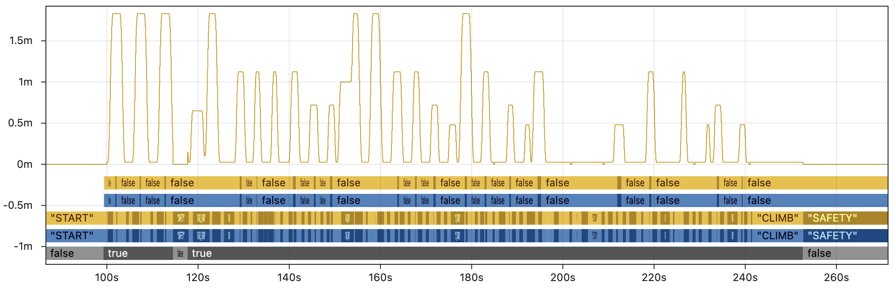
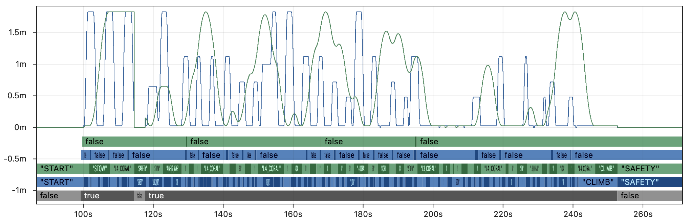
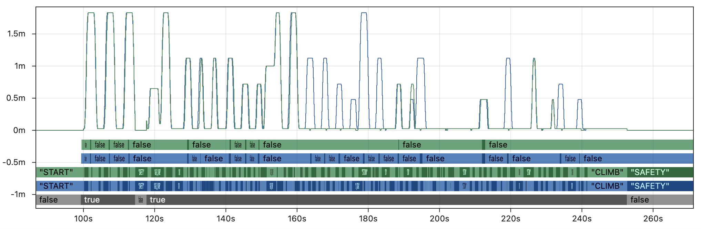
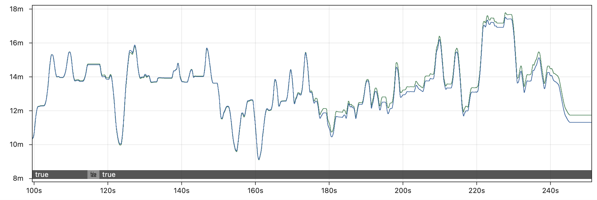
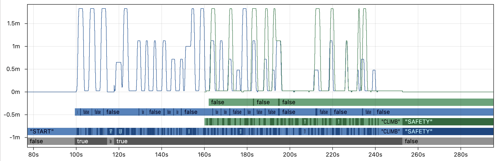

import Tabs from '@theme/Tabs';
import TabItem from '@theme/TabItem';

# 🦋 Log Replay Comparison

FRC teams have access to multiple logging tools that feature "replay" capabilities. These fall into the categories of **deterministic replay** ([AdvantageKit](/getting-started/what-is-advantagekit/), [PyKit](https://github.com/1757WestwoodRobotics/PyKit)) and **nondeterministic replay** ([Hoot Replay](https://v6.docs.ctr-electronics.com/en/latest/docs/api-reference/api-usage/hoot-replay.html)). Each type of replay framework offers significantly different capabilities with regard to determinism, playback functionality, and code structure. This page compares these tools to help teams understand their key differences.

:::note
Many non-replay logging options are also available (such as [WPILib data logging](https://docs.wpilib.org/en/stable/docs/software/telemetry/datalog.html) and [Epilogue](https://docs.wpilib.org/en/stable/docs/software/telemetry/robot-telemetry-with-annotations.html)), but this page focuses exclusively on replay-compatible logging tools.
:::

## 🔒 Determinism

The biggest difference between replay frameworks the ability of each tool to replay robot code logic in a way that is **consistent, trustworthy, and robust to timing inconsistency**.

| Deterministic (AdvantageKit, PyKit)                                                                                                                                  | Non-Deterministic (Hoot Replay)                                                                                                                                                                                       |
| -------------------------------------------------------------------------------------------------------------------------------------------------------------------- | --------------------------------------------------------------------------------------------------------------------------------------------------------------------------------------------------------------------- |
| The replayed robot code will always match the behavior of the real robot. The results of replay can be trusted completely to match the actual behavior of the robot. | No guarantees are made about the accuracy of replay in simulation. Data may arrive in replay at different times or at different rates than the real robot, which impacts the accuracy of all parts of the robot code. |

Determinism has a major impact on the practicality of log replay, since running simulation [faster than real-time](#-rapid-iteration) is a core part of the debugging process in practice. The accuracy of deterministic replay is unaffected by replay speed, while the accuracy of non-deterministic replay decreases when running at faster rates.

### Why Does It Matter?

We are often asked by teams why they should care about deterministic replay. Non-deterministic replay creates butterfly effects that severely impact the accuracy of replay.

<details>
<summary>🦋 The Butterfly Effect 🦋</summary>

The [butterfly effect](https://en.wikipedia.org/wiki/Butterfly_effect) describes how small differences in the inputs to a complex system (like robot code) have ripple effects that can significantly impact the system's behavior in the future. Minor differences in inputs can have a much larger effect on outputs than one might intuitively expect.

The sequence below provides a simple example of how non-deterministic inputs can impact important parts of the robot code:

1. A vision measurement from a camera is lost or delayed due to non-deterministic replay.
2. When combined with odometry data in a pose estimator, the estimated pose of the robot is incorrect for one or more loop cycles.
3. An auto-align command waits for the robot to be within tolerance before scoring. This is a precise operation where errors of less than a centimeter can have a major impact.
4. The driver presses a button to score just after the real robot is within tolerance. Since the replayed robot's pose is inaccurate, the auto-score command rejects the button input in replay (even though it was accepted on the real robot).
5. The superstructure of the robot is now being commanded to a different state on the real robot and in replay, since only the real robot continues the scoring operation.
6. Setpoints to individual mechanisms are now _drastically_ different between the real robot and replay, and do not match the inputs (e.g. encoders) provided to replay. Any tolerance checking of mechanisms is likely to be nonfunctional for the rest of the replay.
7. Future control inputs will not be correctly obeyed in replay, since the states of many commands and subsystems no longer match the real robot.

This scenario may seem specific, but similar divergences are **almost inevitable** when replaying robot code of moderate complexity. The testing in the next section demonstrates what this effect looks like in practice.

</details>

To demonstrate the impact of deterministic replay, the graphics below show real log data from Team 6328's 2025 robot. To represent each category of replay, this data is based on AdvantageKit's deterministic replay (running ~50x faster than real-time) and a close approximation of Hoot Replay (running &lt;5x faster than real-time).

First, the image below shows a few key fields from the AdvantageKit replay. Outputs from the real robot are in blue 🔵 and outputs from AdvantageKit replay are in yellow 🟡. The line graph shows the commanded setpoint of the elevator. From bottom to top, the discrete fields show the enabled state, superstructure state, and whether the robot is in tolerance for scoring. Every field displayed here is an **exact match between real and replay**, providing complete trust in the accuracy of the data.



By contrast, the image below shows the same fields with a close approximation of Hoot Replay running 5x faster than real-time. This is still about 10x _slower_ than AdvantageKit and largely impractical for real debugging workflows. The example shown here is also a _best case scenario_ which includes extensive modifications to the code that compensate for the difference in replay speed.

Outputs from the real robot are in blue 🔵 and outputs from an approximation of Hoot Replay are in green 🟢. Within a _few seconds_ of starting the autonomous routine, the state of the robot has **completely diverged between real and replay** due to the butterfly effect. This significantly reduces the value of the log data for debugging, as it no longer resembles the original behavior.


Keep in mind that replayed outputs are most useful when the equivalent values were not recorded by the real robot (i.e. there is no reference point to verify accuracy). For that critical use case, there is _no way to distinguish accurate outputs_ from the inaccurate, diverged outputs shown above. This undermines the core purpose of replay, as the outputs cannot be trusted for debugging.

<details>
<summary>More Details</summary>

The graphs above shows the results of replaying 5x faster than real-time with additional modifications to compensate for loop cycle time, though these changes would not be part of a typical robot project. We have provided several other test cases to demonstrate the impact of different replay settings:

**5x faster than real-time, typical robot project:**



**2x faster than real-time, typical robot project:**


**2x faster than real-time, compensated:**



Note that even the _very best case_ shown in the last graph still breaks down completely midway through the match, and is unable to replay critical fields like the auto scoring tolerance.

**What about other fields?**

It is true that some fields are more affected by replay inaccuracy than others. For example, the graph below compares the X position of drive odometry between the real robot and Hoot Replay running 5x faster than real-time. Odometry is only affected by the drive motors, so it is less subject to the butterfly effect than other parts of the code (though it still drifts several feet by the end of the match).

Log replay is most helpful when untangling complex code logic that is nontrivial to recreate without the full set of input data, as demonstrated even in our [simplest examples](/getting-started/what-is-advantagekit/example-output-logging). Odometry data and other trivial fields serve as a partial exception to the butterfly effect, but (as noted above) the lack of reference points when running replay in practice means that it is never possible to distinguish non-deterministic outputs that are _slightly inaccurate_ (odometry) from the majority of outputs that are _completely inaccurate_.



**What about skipping in time?**

The [section below](#-rapid-iteration) explains why rapid iteration and running faster than real-time are critical to any replay workflow, which is why the examples above demonstrate the impact of running Hoot Replay faster than real-time. However, one could also start the replay at a later point in the log file to work around the slow speed of non-deterministic replay.

The graph below demonstrates why this approach is ineffective, by skipping to the middle of teleop before running simulated Hoot Replay (2x faster than real-time with loop cycle compensation). Even in this best-case scenario for Hoot Replay running at only 2x speed, the replay is completely unable to match the real outputs. Skipping large parts of the log massively increases the impact of the butterfly effect by completely changing the set of inputs accessible to the replayed code. One should not expect to see accurate outputs at any speed unless all of the inputs are accounted for during replay.



</details>

## 💨 Rapid Iteration

Log replay can be used in a variety of environments, which take advantage of the ability to rapidly iterate on code or debug issues without access to the robot. Here are a few examples where replay can play a critical role in the debugging process:

- Debugging complex logic issues between matches without access to a practice field.
- Retuning an auto-score tolerance in the pits based on data from the last match.
- Testing a variety of vision filtering techniques between in-person meetings.
- Remotely debugging issues for a team by repeatedly logging additional outputs.
- Generating outputs after every match that are too complex to run on the RoboRIO.

Every one of these use cases **depends on being able to run replay faster than real-time**. A typical match log may be 10 minutes long, and a replay feature that takes 10 minutes to run is not practical in any of these scenarios. Whether log replay is used under time pressure at an event or at home for rapid debugging, quickly running multiple replays with different outputs or tuning parameters is absolutely core to its utility.

### Comparison

| AdvantageKit/PyKit                                                  | Hoot Replay                                        |
| ------------------------------------------------------------------- | -------------------------------------------------- |
| ✅ Run as fast as possible (e.g. ~50x real-time)                    | ❌ Accuracy decreases with faster speeds           |
| ✅ [Replay Watch](/getting-started/replay-watch) for fast iteration | ❌ Replay process is fully manual                  |
| ✅ Pull and push logs directly to AdvantageScope                    | ❌ Manual file management, multiple logs per match |

Deterministic replay means that accuracy is unaffected by the replay speed. Running replay ~50 times faster than real-time is common, which means that **a 10 minute match log can be replayed in just _12 seconds_**. AdvantageKit is designed to make rapid iteration as painless as possible through features like [Replay Watch](/getting-started/replay-watch) and integration with AdvantageScope; just open a log, run replay, and see the results with _no manual log management required_.

By contrast, Hoot Replay's non-deterministic approach presents users with difficult trade-offs between accuracy and practicality. Running at just 5x speed already has a **[major impact](#why-does-it-matter) on accuracy while still taking a full _2 minutes_** per replay iteration. Non-determinism makes replay more difficult to use in the high-pressure scenarios where it matters the most.

The video below demonstrates what the difference in speed between deterministic and non-deterministic replay looks like in practice. Several replays of the same log are synchronized and shown in real-time.

<iframe width="100%" style={{"aspect-ratio": "3024 / 934"}} src="https://www.youtube.com/embed/SJ0F47Zej-4" title="Log Replay Speed Comparison" frameborder="0" allow="accelerometer; autoplay; clipboard-write; encrypted-media; gyroscope; picture-in-picture; web-share" referrerpolicy="strict-origin-when-cross-origin" allowfullscreen></iframe>

## 🧱 Code Structure

While Hoot Replay involves significant trade-offs, its core design goal is to "simplify" hardware interactions. Unlike AdvantageKit, some subsystems may be compatible with Hoot Replay while using CTRE's standard subsystem structure (combining high-level logic, hardware configuration, low-level controls, and simulation in a single class).

Subsystems under Hoot Replay fall into the two categories shown below. Note that users must select a **single CAN bus** to replay, which means that many subsystems using entirely CTRE devices are not natively compatible with Hoot Replay. For subsystems that are not natively compatible, **every input must be manually logged and replayed**.

| **Natively Compatible**                                | **Manual Logging**                                                                                                                                                                                             |
| ------------------------------------------------------ | -------------------------------------------------------------------------------------------------------------------------------------------------------------------------------------------------------------- |
| <ul><li>CTRE devices on the replayed CAN bus</li></ul> | <ul><li>All other CTRE devices</li><li>Non-CTRE devices</li><li>Non-CAN sensors (e.g. RIO data)</li><li>Network devices (e.g. Limelight, PhotonVision)</li><li>Dashboard inputs (e.g. auto choosers)</li></ul> |

### Hardware Abstraction vs. Data Injection

All replay frameworks sometimes require users to use alternative structures that maintain compatibility with replay. AdvantageKit and PyKit build all subsystems around [hardware abstraction](/data-flow/recording-inputs/io-interfaces), which provides a clean separation between parts of the code logic that must be isolated: high-level logic, simulation, and replayed code are never able to interact in unintended ways.

The table below compares the implications of this structure against Hoot Replay's approach:

|                    | [Hardware Abstraction](/data-flow/recording-inputs/io-interfaces)<br />(AdvantageKit, PyKit)                                                                                               | [Data Injection](https://v6.docs.ctr-electronics.com/en/docs-2026-beta/docs/api-reference/api-usage/hoot-replay.html#adjusting-robot-code-architecture)<br />(Hoot Replay) |
| ------------------ | ------------------------------------------------------------------------------------------------------------------------------------------------------------------------------------------ | -------------------------------------------------------------------------------------------------------------------------------------------------------------------------- |
| **Code Structure** | The functions of each subsystem are divided into several smaller classes.                                                                                                                  | All functions of the subsystem are combined into a single large class.                                                                                                     |
| **Templates**      | ✅ AdvantageKit provides [template projects](/getting-started/template-projects) for many subsystems including swerve drives and vision systems (compatible with several vendors).         | ⚠️ Minimal examples are provided. No template projects for subsystems with manual logging.                                                                                 |
| **Data Flow**      | ✅ Data flow is well-defined to ensure clean separation between real, replay, and sim modes.                                                                                               | ❌ All data is accessible to all parts of the subsystem. Careful planning and frequent testing is required to ensure that modes are well-separated.                        |
| **Input Logging**  | ✅ Error-free logging of a large number of inputs is facilitated by [annotation](/data-flow/recording-inputs/annotation-logging) and [record](/data-flow/supported-types#records) logging. | ❌ Each new input field requires several lines of additional boilerplate, which can easily cause subtle issues during replay if implemented incorrectly.                   |
| **Dashboards**     | ✅ Convenience classes are provided to simplify the process of using [dashboard inputs](/data-flow/recording-inputs/dashboard-inputs).                                                     | ❌ All data must be logged manually by the user, even outside of subsystems.                                                                                               |

### Example: Vision Subsystem

The code below represents a feature-complete Limelight vision subsystem built with both AdvantageKit (hardware abstraction) and Hoot Replay (data injection):

- The AdvantageKit version creates clean separation between the different components of the vision system, making each class easier to understand and debug. The hardware interface with automatic logging enforces clear and correct data flows _by default_. Annotation, record, and enum logging also allow complex data types to be logged with minimal effort, as shown in the `VisionIOInputs` class below.
- The Hoot Replay version combines all of the functionality in a single class, with manual hooks to read and write data for each input field. Note that there is no obvious separation between the the replayed and non-replayed parts of the code, making it easy to read from invalid data sources or replay data incorrectly. The minimal utilities for logging complex types also result in a confusing structure for input data.

<div class="small-code">

<Tabs>
<TabItem value="akit" label="AdvantageKit">
<Tabs>
<TabItem value="vision" label="Subsystem">

_Vision subsystem (103 lines)_

```java
public class Vision extends SubsystemBase {
  private final VisionConsumer consumer;
  private final VisionIO io;
  private final VisionIOInputsAutoLogged inputs = new VisionIOInputsAutoLogged();
  private final Alert disconnectedAlert =
      new Alert("Vision camera is disconnected.", AlertType.kWarning);

  public Vision(VisionConsumer consumer, VisionIO io) {
    this.consumer = consumer;
    this.io = io;
  }

  /** Returns the X angle to the best target, which can be used for simple servoing with vision. */
  public Rotation2d getTargetX() {
    return inputs.latestTargetObservation.tx();
  }

  @Override
  public void periodic() {
    io.updateInputs(inputs);
    Logger.processInputs("Vision", inputs);

    // Update disconnected alert
    disconnectedAlert.set(!inputs.connected);

    // Initialize logging values
    List<Pose3d> tagPoses = new LinkedList<>();
    List<Pose3d> robotPoses = new LinkedList<>();
    List<Pose3d> robotPosesAccepted = new LinkedList<>();
    List<Pose3d> robotPosesRejected = new LinkedList<>();

    // Add tag poses
    for (int tagId : inputs.tagIds) {
      var tagPose = aprilTagLayout.getTagPose(tagId);
      if (tagPose.isPresent()) {
        tagPoses.add(tagPose.get());
      }
    }

    // Loop over pose observations
    for (var observation : inputs.poseObservations) {
      // Check whether to reject pose
      boolean rejectPose =
          observation.tagCount() == 0 // Must have at least one tag
              || (observation.tagCount() == 1
                  && observation.ambiguity() > maxAmbiguity) // Cannot be high ambiguity
              || Math.abs(observation.pose().getZ()) > maxZError // Must have realistic Z coordinate

              // Must be within the field boundaries
              || observation.pose().getX() < 0.0
              || observation.pose().getX() > aprilTagLayout.getFieldLength()
              || observation.pose().getY() < 0.0
              || observation.pose().getY() > aprilTagLayout.getFieldWidth();

      // Add pose to log
      robotPoses.add(observation.pose());
      if (rejectPose) {
        robotPosesRejected.add(observation.pose());
      } else {
        robotPosesAccepted.add(observation.pose());
      }

      // Skip if rejected
      if (rejectPose) {
        continue;
      }

      // Calculate standard deviations
      double stdDevFactor =
          Math.pow(observation.averageTagDistance(), 2.0) / observation.tagCount();
      double linearStdDev = linearStdDevBaseline * stdDevFactor;
      double angularStdDev = angularStdDevBaseline * stdDevFactor;
      if (observation.type() == PoseObservationType.MEGATAG_2) {
        linearStdDev *= linearStdDevMegatag2Factor;
        angularStdDev *= angularStdDevMegatag2Factor;
      }

      // Send vision observation
      consumer.accept(
          observation.pose().toPose2d(),
          observation.timestamp(),
          VecBuilder.fill(linearStdDev, linearStdDev, angularStdDev));
    }

    // Log camera metadata
    Logger.recordOutput("Vision/TagPoses", tagPoses.toArray(new Pose3d[tagPoses.size()]));
    Logger.recordOutput("Vision/RobotPoses", robotPoses.toArray(new Pose3d[robotPoses.size()]));
    Logger.recordOutput(
        "Vision/RobotPosesAccepted",
        robotPosesAccepted.toArray(new Pose3d[robotPosesAccepted.size()]));
    Logger.recordOutput(
        "Vision/RobotPosesRejected",
        robotPosesRejected.toArray(new Pose3d[robotPosesRejected.size()]));
  }

  @FunctionalInterface
  public static interface VisionConsumer {
    public void accept(
        Pose2d visionRobotPoseMeters,
        double timestampSeconds,
        Matrix<N3, N1> visionMeasurementStdDevs);
  }
}
```

</TabItem>
<TabItem value="visionio" label="Hardware Interface" default>

_Vision hardware interface (30 lines)_

```java
public interface VisionIO {
  @AutoLog
  public static class VisionIOInputs {
    public boolean connected = false;
    public TargetObservation latestTargetObservation =
        new TargetObservation(Rotation2d.kZero, Rotation2d.kZero);
    public PoseObservation[] poseObservations = new PoseObservation[0];
    public int[] tagIds = new int[0];
  }

  /** Represents the angle to a simple target, not used for pose estimation. */
  public static record TargetObservation(Rotation2d tx, Rotation2d ty) {}

  /** Represents a robot pose sample used for pose estimation. */
  public static record PoseObservation(
      double timestamp,
      Pose3d pose,
      double ambiguity,
      int tagCount,
      double averageTagDistance,
      PoseObservationType type) {}

  public static enum PoseObservationType {
    MEGATAG_1,
    MEGATAG_2,
    PHOTONVISION
  }

  public default void updateInputs(VisionIOInputs inputs) {}
}
```

</TabItem>
<TabItem value="visioniolimelight" label="Hardware Implementation">

_Vision hardware implementation (103 lines)_

```java
public class VisionIOLimelight implements VisionIO {
  private final Supplier<Rotation2d> rotationSupplier;
  private final DoubleArrayPublisher orientationPublisher;

  private final DoubleSubscriber latencySubscriber;
  private final DoubleSubscriber txSubscriber;
  private final DoubleSubscriber tySubscriber;
  private final DoubleArraySubscriber megatag1Subscriber;
  private final DoubleArraySubscriber megatag2Subscriber;

  /**
   * Creates a new VisionIOLimelight.
   *
   * @param name The configured name of the Limelight.
   * @param rotationSupplier Supplier for the current estimated rotation, used for MegaTag 2.
   */
  public VisionIOLimelight(String name, Supplier<Rotation2d> rotationSupplier) {
    var table = NetworkTableInstance.getDefault().getTable(name);
    this.rotationSupplier = rotationSupplier;
    orientationPublisher = table.getDoubleArrayTopic("robot_orientation_set").publish();
    latencySubscriber = table.getDoubleTopic("tl").subscribe(0.0);
    txSubscriber = table.getDoubleTopic("tx").subscribe(0.0);
    tySubscriber = table.getDoubleTopic("ty").subscribe(0.0);
    megatag1Subscriber = table.getDoubleArrayTopic("botpose_wpiblue").subscribe(new double[] {});
    megatag2Subscriber =
        table.getDoubleArrayTopic("botpose_orb_wpiblue").subscribe(new double[] {});
  }

  @Override
  public void updateInputs(VisionIOInputs inputs) {
    // Update connection status based on whether an update has been seen in the last 250ms
    inputs.connected =
        ((RobotController.getFPGATime() - latencySubscriber.getLastChange()) / 1000) < 250;

    // Update target observation
    inputs.latestTargetObservation =
        new TargetObservation(
            Rotation2d.fromDegrees(txSubscriber.get()), Rotation2d.fromDegrees(tySubscriber.get()));

    // Update orientation for MegaTag 2
    orientationPublisher.accept(
        new double[] {rotationSupplier.get().getDegrees(), 0.0, 0.0, 0.0, 0.0, 0.0});
    NetworkTableInstance.getDefault()
        .flush(); // Increases network traffic but recommended by Limelight

    // Read new pose observations from NetworkTables
    Set<Integer> tagIds = new HashSet<>();
    List<PoseObservation> poseObservations = new LinkedList<>();
    for (var rawSample : megatag1Subscriber.readQueue()) {
      if (rawSample.value.length == 0) continue;
      for (int i = 11; i < rawSample.value.length; i += 7) {
        tagIds.add((int) rawSample.value[i]);
      }
      poseObservations.add(
          new PoseObservation(
              rawSample.timestamp * 1.0e-6 - rawSample.value[6] * 1.0e-3,
              parsePose(rawSample.value),
              rawSample.value.length >= 18 ? rawSample.value[17] : 0.0,
              (int) rawSample.value[7],
              rawSample.value[9],
              PoseObservationType.MEGATAG_1));
    }
    for (var rawSample : megatag2Subscriber.readQueue()) {
      if (rawSample.value.length == 0) continue;
      for (int i = 11; i < rawSample.value.length; i += 7) {
        tagIds.add((int) rawSample.value[i]);
      }
      poseObservations.add(
          new PoseObservation(
              rawSample.timestamp * 1.0e-6 - rawSample.value[6] * 1.0e-3,
              parsePose(rawSample.value),
              0.0,
              (int) rawSample.value[7],
              rawSample.value[9],
              PoseObservationType.MEGATAG_2));
    }

    // Save pose observations to inputs object
    inputs.poseObservations = new PoseObservation[poseObservations.size()];
    for (int i = 0; i < poseObservations.size(); i++) {
      inputs.poseObservations[i] = poseObservations.get(i);
    }

    // Save tag IDs to inputs objects
    inputs.tagIds = new int[tagIds.size()];
    int i = 0;
    for (int id : tagIds) {
      inputs.tagIds[i++] = id;
    }
  }

  /** Parses the 3D pose from a Limelight botpose array. */
  private static Pose3d parsePose(double[] rawLLArray) {
    return new Pose3d(
        rawLLArray[0],
        rawLLArray[1],
        rawLLArray[2],
        new Rotation3d(
            Units.degreesToRadians(rawLLArray[3]),
            Units.degreesToRadians(rawLLArray[4]),
            Units.degreesToRadians(rawLLArray[5])));
  }
}
```

</TabItem>
</Tabs>
</TabItem>
<TabItem value="hoot" label="Hoot Replay">

_Vision subsystem and hardware interface (248 lines)_

```java
public class HootVision extends SubsystemBase {
  private final VisionConsumer consumer;
  private final Alert disconnectedAlert =
      new Alert("Vision camera is disconnected.", AlertType.kWarning);
  private final Supplier<Rotation2d> rotationSupplier;
  private final DoubleArrayPublisher orientationPublisher;

  private final DoubleSubscriber latencySubscriber;
  private final DoubleSubscriber txSubscriber;
  private final DoubleSubscriber tySubscriber;
  private final DoubleArraySubscriber megatag1Subscriber;
  private final DoubleArraySubscriber megatag2Subscriber;

  private boolean connected = false;
  private Rotation2d latestTargetObservationTx = Rotation2d.kZero;
  private Rotation2d latestTargetObservationTy = Rotation2d.kZero;
  private double[] timestamps = new double[] {};
  private Pose3d[] poses = new Pose3d[] {};
  private double[] ambiguities = new double[] {};
  private int[] tagCounts = new int[] {};
  private double[] averageTagDistances = new double[] {};
  private int[] types = new int[] {};
  public int[] tagIds = new int[] {};

  private final HootAutoReplay hootReplay =
      new HootAutoReplay()
          .withBoolean("Connected", () -> connected, (value) -> connected = value.value)
          .withStruct(
              "Vision/LatestTargetObservationTx",
              Rotation2d.struct,
              () -> latestTargetObservationTx,
              (value) -> latestTargetObservationTx = value.value)
          .withStruct(
              "Vision/LatestTargetObservationTy",
              Rotation2d.struct,
              () -> latestTargetObservationTy,
              (value) -> latestTargetObservationTx = value.value)
          .withDoubleArray(
              "Vision/Timestamps", () -> timestamps, (value) -> timestamps = value.value)
          .withStructArray(
              "Vision/Poses", Pose3d.struct, () -> poses, (value) -> poses = value.value)
          .withDoubleArray(
              "Vision/Ambiguities", () -> ambiguities, (value) -> ambiguities = value.value)
          .withIntegerArray(
              "Vision/Timestamps",
              () -> Arrays.stream(tagCounts).mapToLong(i -> i).toArray(),
              (value) -> tagCounts = Arrays.stream(value.value).mapToInt(i -> (int) i).toArray())
          .withDoubleArray(
              "Vision/AverageTagDistances",
              () -> averageTagDistances,
              (value) -> averageTagDistances = value.value)
          .withIntegerArray(
              "Vision/Types",
              () -> Arrays.stream(types).mapToLong(i -> i).toArray(),
              (value) -> types = Arrays.stream(value.value).mapToInt(i -> (int) i).toArray())
          .withIntegerArray(
              "Vision/TagIds",
              () -> Arrays.stream(tagIds).mapToLong(i -> i).toArray(),
              (value) -> tagIds = Arrays.stream(value.value).mapToInt(i -> (int) i).toArray());

  public HootVision(VisionConsumer consumer, String name, Supplier<Rotation2d> rotationSupplier) {
    this.consumer = consumer;
    var table = NetworkTableInstance.getDefault().getTable(name);
    this.rotationSupplier = rotationSupplier;
    orientationPublisher = table.getDoubleArrayTopic("robot_orientation_set").publish();
    latencySubscriber = table.getDoubleTopic("tl").subscribe(0.0);
    txSubscriber = table.getDoubleTopic("tx").subscribe(0.0);
    tySubscriber = table.getDoubleTopic("ty").subscribe(0.0);
    megatag1Subscriber = table.getDoubleArrayTopic("botpose_wpiblue").subscribe(new double[] {});
    megatag2Subscriber =
        table.getDoubleArrayTopic("botpose_orb_wpiblue").subscribe(new double[] {});
  }

  @Override
  public void periodic() {
    if (!Utils.isReplay()) {
      // Update connection status based on whether an update has been seen in the last 250ms
      connected =
          ((RobotController.getFPGATime() - latencySubscriber.getLastChange()) / 1000) < 250;

      // Update target observation
      latestTargetObservationTx = Rotation2d.fromDegrees(txSubscriber.get());
      latestTargetObservationTy = Rotation2d.fromDegrees(tySubscriber.get());

      // Update orientation for MegaTag 2
      orientationPublisher.accept(
          new double[] {rotationSupplier.get().getDegrees(), 0.0, 0.0, 0.0, 0.0, 0.0});
      NetworkTableInstance.getDefault()
          .flush(); // Increases network traffic but recommended by Limelight

      // Read new pose observations from NetworkTables
      Set<Integer> tagIds = new HashSet<>();
      List<PoseObservation> poseObservations = new LinkedList<>();
      for (var rawSample : megatag1Subscriber.readQueue()) {
        if (rawSample.value.length == 0) continue;
        for (int i = 11; i < rawSample.value.length; i += 7) {
          tagIds.add((int) rawSample.value[i]);
        }
        poseObservations.add(
            new PoseObservation(
                rawSample.timestamp * 1.0e-6 - rawSample.value[6] * 1.0e-3,
                parsePose(rawSample.value),
                rawSample.value.length >= 18 ? rawSample.value[17] : 0.0,
                (int) rawSample.value[7],
                rawSample.value[9],
                PoseObservationType.MEGATAG_1));
      }
      for (var rawSample : megatag2Subscriber.readQueue()) {
        if (rawSample.value.length == 0) continue;
        for (int i = 11; i < rawSample.value.length; i += 7) {
          tagIds.add((int) rawSample.value[i]);
        }
        poseObservations.add(
            new PoseObservation(
                rawSample.timestamp * 1.0e-6 - rawSample.value[6] * 1.0e-3,
                parsePose(rawSample.value),
                0.0,
                (int) rawSample.value[7],
                rawSample.value[9],
                PoseObservationType.MEGATAG_2));
      }

      // Save pose observations to inputs
      timestamps = new double[poseObservations.size()];
      poses = new Pose3d[poseObservations.size()];
      ambiguities = new double[poseObservations.size()];
      tagCounts = new int[poseObservations.size()];
      averageTagDistances = new double[poseObservations.size()];
      types = new int[poseObservations.size()];
      for (int i = 0; i < poseObservations.size(); i++) {
        var obs = poseObservations.get(i);
        timestamps[i] = obs.timestamp();
        poses[i] = obs.pose();
        ambiguities[i] = obs.ambiguity();
        tagCounts[i] = obs.tagCount();
        averageTagDistances[i] = obs.averageTagDistance();
        types[i] = obs.type().ordinal();
      }

      // Save tag IDs to inputs
      this.tagIds = new int[tagIds.size()];
      int i = 0;
      for (int tagId : tagIds) {
        this.tagIds[i++] = tagId;
      }
    }
    hootReplay.update();

    // Update disconnected alert
    disconnectedAlert.set(!connected);

    // Initialize logging values
    List<Pose3d> tagPoses = new LinkedList<>();
    List<Pose3d> robotPoses = new LinkedList<>();
    List<Pose3d> robotPosesAccepted = new LinkedList<>();
    List<Pose3d> robotPosesRejected = new LinkedList<>();

    // Add tag poses
    for (int tagId : tagIds) {
      var tagPose = aprilTagLayout.getTagPose(tagId);
      if (tagPose.isPresent()) {
        tagPoses.add(tagPose.get());
      }
    }

    // Loop over pose observations
    for (int i = 0; i < timestamps.length; i++) {
      // Check whether to reject pose
      boolean rejectPose =
          tagCounts[i] == 0 // Must have at least one tag
              || (tagCounts[i] == 1 && ambiguities[i] > maxAmbiguity) // Cannot be high ambiguity
              || Math.abs(poses[i].getZ()) > maxZError // Must have realistic Z coordinate

              // Must be within the field boundaries
              || poses[i].getX() < 0.0
              || poses[i].getX() > aprilTagLayout.getFieldLength()
              || poses[i].getY() < 0.0
              || poses[i].getY() > aprilTagLayout.getFieldWidth();

      // Add pose to log
      robotPoses.add(poses[i]);
      if (rejectPose) {
        robotPosesRejected.add(poses[i]);
      } else {
        robotPosesAccepted.add(poses[i]);
      }

      // Skip if rejected
      if (rejectPose) {
        continue;
      }

      // Calculate standard deviations
      double stdDevFactor = Math.pow(averageTagDistances[i], 2.0) / tagCounts[i];
      double linearStdDev = linearStdDevBaseline * stdDevFactor;
      double angularStdDev = angularStdDevBaseline * stdDevFactor;
      if (types[i] == 1) {
        linearStdDev *= linearStdDevMegatag2Factor;
        angularStdDev *= angularStdDevMegatag2Factor;
      }

      // Send vision observation
      consumer.accept(
          poses[i].toPose2d(),
          timestamps[i],
          VecBuilder.fill(linearStdDev, linearStdDev, angularStdDev));
    }

    // Log camera metadata
    SignalLogger.writeStructArray(
        "Vision/TagPoses", Pose3d.struct, tagPoses.toArray(new Pose3d[tagPoses.size()]));
    SignalLogger.writeStructArray(
        "Vision/RobotPoses", Pose3d.struct, robotPoses.toArray(new Pose3d[robotPoses.size()]));
    SignalLogger.writeStructArray(
        "Vision/RobotPosesAccepted",
        Pose3d.struct,
        robotPosesAccepted.toArray(new Pose3d[robotPosesAccepted.size()]));
    SignalLogger.writeStructArray(
        "Vision/RobotPosesRejected",
        Pose3d.struct,
        robotPosesRejected.toArray(new Pose3d[robotPosesRejected.size()]));
  }

  /** Returns the X angle to the best target, which can be used for simple servoing with vision. */
  public Rotation2d getTargetX() {
    return Rotation2d.fromDegrees(txSubscriber.get());
  }

  /** Parses the 3D pose from a Limelight botpose array. */
  private static Pose3d parsePose(double[] rawLLArray) {
    return new Pose3d(
        rawLLArray[0],
        rawLLArray[1],
        rawLLArray[2],
        new Rotation3d(
            Units.degreesToRadians(rawLLArray[3]),
            Units.degreesToRadians(rawLLArray[4]),
            Units.degreesToRadians(rawLLArray[5])));
  }

  @FunctionalInterface
  public static interface VisionConsumer {
    public void accept(
        Pose2d visionRobotPoseMeters,
        double timestampSeconds,
        Matrix<N3, N1> visionMeasurementStdDevs);
  }
}
```

:::danger
Did you notice that this example of Hoot Replay actually has **three separate** subtle but critical issues that prevent replay from functioning? The monolithic structure of data injection and a lack of automatic logging options make subtle typos extremely common and challenging to debug.
:::

</TabItem>
</Tabs>

</div>

## 📋 Miscellaneous

The table below provides an overview of the differences between each replay tool. Note that some of the restrictions of Hoot Replay can be addressed via complex manual logging as discussed above.

|                     | AdvantageKit                                       | PyKit                                       | Hoot Replay                                                                             |
| ------------------- | -------------------------------------------------- | ------------------------------------------- | --------------------------------------------------------------------------------------- |
| **Accuracy**        | ✅ Deterministic                                   | ✅ Deterministic                            | ❌ Non-deterministic                                                                    |
| **Rapid Iteration** | ✅ Replay at any speed                             | ✅ Replay at any speed                      | ❌ Accuracy decreases with speed                                                        |
| **Code Structure**  | ✅ Hardware abstraction + automatic logging        | ✅ Hardware abstraction + automatic logging | ❌ Manual data injection                                                                |
| **Vendor**          | ✅ No restriction + templates for multiple vendors | ✅ No restriction                           | ❌ Vendor-locked to CTRE devices                                                        |
| **CAN Buses**       | ✅ No restriction                                  | ✅ No restriction                           | ❌ Requires a single CAN bus                                                            |
| **FRC Languages**   | Java                                               | Python                                      | Java, Python, C++                                                                       |
| **Pricing**         | Free & Open Source                                 | Free & Open Source                          | 💰 Subscription: Requires [Phoenix Pro](https://store.ctr-electronics.com/phoenix-pro/) |
| **Users in 2025**   | 598 teams                                          | NA                                          | &lt;10 teams                                                                            |

:::note
The number of AdvantageKit users is based on official usage reporting data published by FIRST. The number of Hoot Replay users is estimated based on a search of public GitHub repositories using Hoot Replay and the percentage of all teams that publish code on GitHub.
:::
