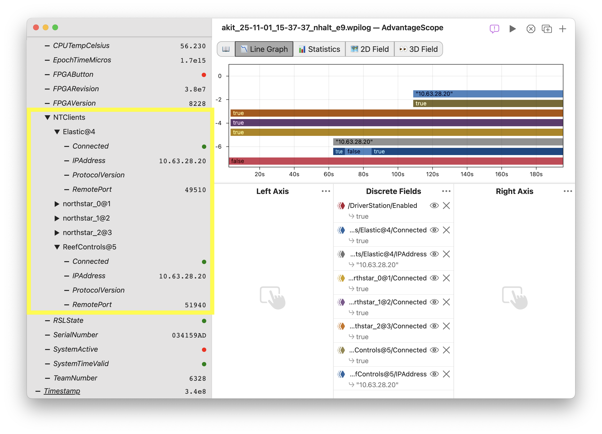
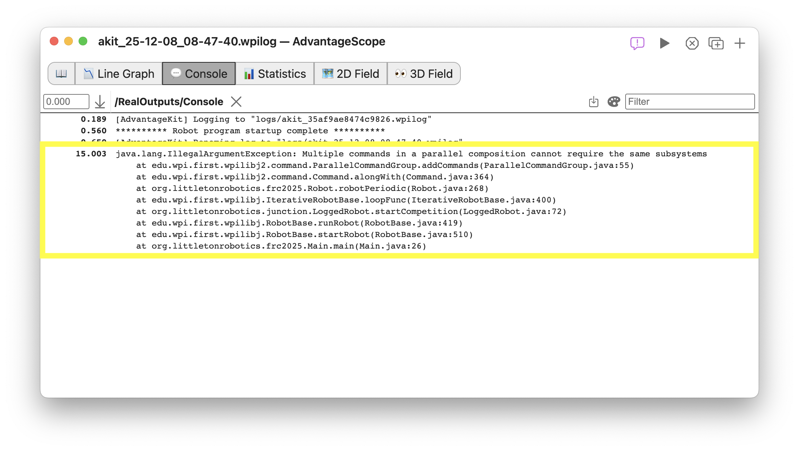
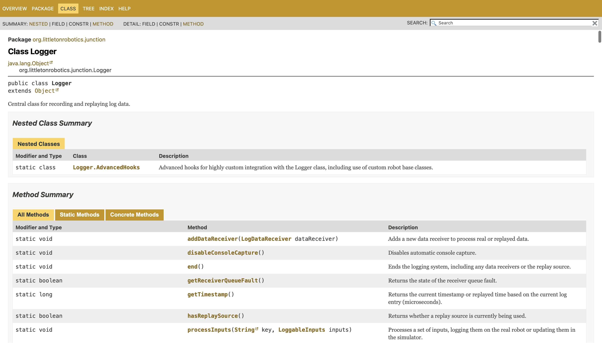
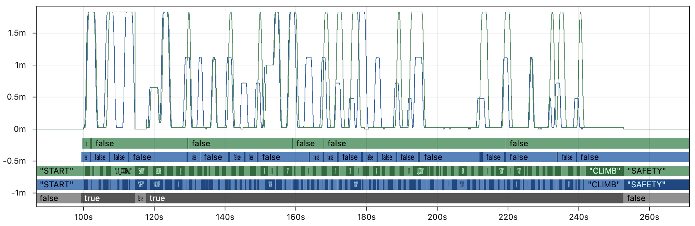

import BannerLight from "./img/whats-new/banner-light.png";
import BannerDark from "./img/whats-new/banner-dark.png";
import MechanismImg from "./img/whats-new/mechanism.png";

#


The 2026 version of AdvantageKit is now available in beta! In addition to adding support for WPILib 2026, this release includes several major new features and documentation improvements. To get started with the AdvantageKit 2026 beta, check the [installation page](/getting-started/installation/) and use the first release with version v26.0.0-beta-X. Check the full changelog for a complete list of changes. The most notable features in this release are documented below.

**We value your feedback! Feedback, feature requests, and bug reports are welcome on the [issues page](https://github.com/Mechanical-Advantage/AdvantageKit/issues).**

:::warning
AdvantageKit 2026 is in beta, which means that teams will encounter issues not present in stable releases. Beta releases allow teams to experiment with upcoming features and provide feedback before the official release in January 2026. Users looking for a stable release should use AdvantageKit v4.1.6, the latest 2025 release.
:::

## 🧮 Unit Logging

All logging interfaces now support specifying unit metadata compatible with [unit-aware graphing](https://docs.advantagescope.org/tab-reference/line-graph/units) in AdvantageScope. Several examples of unit metadata logging are shown in the code block below. For more details, check the documentation [here](/data-flow/supported-types#units).

```java
Logger.recordOutput("MyAngle", 3.141, "radians");
Logger.recordOutput("MyDistance", Meters.of(63.28));
Logger.recordOutput("MyCurrent", 42.0, Amps);

@AutoLog
public class Inputs {
    public Distance current = Amps.of(63.28);
}

public class Outputs {
    @AutoLogOutput(unit = "inches")
    private double setpoint = 44600.0;

    @AutoLogOutput
    private Distance volts = Volts.of(12.6);
}
```

## 🛜 NetworkTables Client Logging

The `SystemStats` table now tracks which clients are connected to the NetworkTables server, including dashboards and vision coprocessors. This makes it easy to check when devices are online with no additional logging in user code. For each client, AdvantageKit automatically logs the connection status, IP address, remote port, and protocol version.



## 💬 Improved Console Logging

AdvantageKit's [automatic console logging](/data-flow/built-in-logging#console) has been improved to capture exceptions thrown during robot code execution. This makes it easier to debug code crashes without needing to reference the Driver Station log file.

In addition, console output is now displayed during [Replay Watch](/getting-started/replay-watch) to make it easier to debug robot programs when rapidly iterating on code.



## 📦 Log Mechanisms as 3D Components

AdvantageKit now offers an easier method of visualizing simple [articulated components](https://docs.advantagescope.org/tab-reference/3d-field/#3d-components) in AdvantageScope. The [`LoggedMechanism2d.generate3dMechanism`](<pathname:///javadoc/org/littletonrobotics/junction/mechanism/LoggedMechanism2d.html#generate3dMechanism()>) method can be used to _automatically_ generate a set of 3D poses for visualizing full 3D components in AdvantageScope. No need to manually transform 3D poses when creating an array of components!


## 🎨 Color Logging

WPILib includes a [color library](https://github.wpilib.org/allwpilib/docs/release/java/edu/wpi/first/wpilibj/util/Color.html) that can be used to simplify color operations. These objects can now be logged as inputs or outputs, and will be stored in the log as a string formatted in [Hex Triplet](https://en.wikipedia.org/wiki/Web_colors) color notation.

<details>
<summary>...</summary>


</details>

## 📒 Online Documentation

The AdvantageKit documentation has been significantly improved:

- Online [API documentation](pathname:///javadoc) is now available.
- Page organization has been improved, including the additional of a new [theory](/category/theory) section.
- Video case studies from previous FIRST Championship conference are catalogged [here](/theory/case-studies).



## 🦋 All-New Log Replay Comparison

The [log replay comparison](/theory/log-replay-comparison) page has been rewritten to be more clear, accurate, and **data-driven**. This includes deeper analysis of the effects of determinism on replay, real-world examples of the impact of rapid code iteration, and sample code exploring different subsystem code structures.

:::info
These updates bring the AdvantageKit documentation up-to-date with the [2026 release](https://v6.docs.ctr-electronics.com/en/latest/docs/yearly-changes/yearly-changelog.html#hoot-replay-improvements) of CTRE's Hoot Replay.
:::



_The graph above compares data produced on a real FRC robot to data produced by non-deterministic replay. See [here](/theory/log-replay-comparison/#why-does-it-matter) for details._

## 🦤 New TalonFX(S) Swerve Template

The [TalonFX swerve template](/getting-started/template-projects/talonfx-swerve-template) has been updated with an alternative module implementation for the [TalonFXS](https://store.ctr-electronics.com/products/talon-fxs) and [CANdi](https://store.ctr-electronics.com/products/candi). Check the [documentation](/getting-started/template-projects/talonfx-swerve-template/#custom-module-implementations) for more details on configuring the template for _any_ hardware setup, including a mix of devices from different vendors.

## 🐍 Bonus: Third-Party Replay in Python

While AdvantageKit is only available in Java, FRC teams developing in Python should consider using [PyKit](https://github.com/1757WestwoodRobotics/PyKit) instead. This library was developed by Team 1757 and supports deterministic log replay in Python.

:::note
Littleton Robotics is not involved in the development of PyKit. All questions should be directed to Team 1757.
:::
