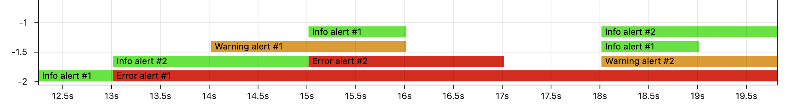
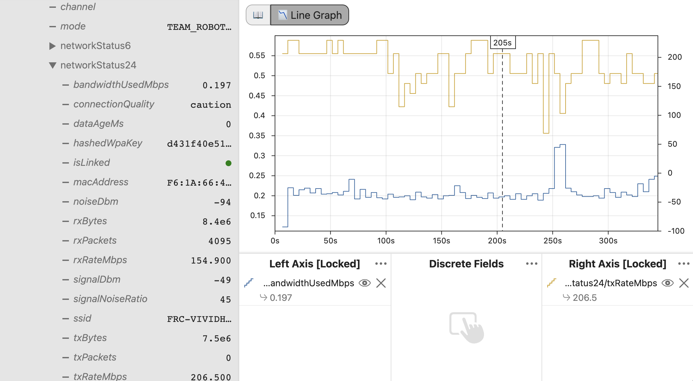

# What's New in 2025?

<h2 style={{textAlign: "center"}}>Log Replay, Streamlined</h2>

### 🏠 All-New Template Projects

The AdvantageKit template projects have been reimagined from the ground up with improved features and documentation:

- The reimagined swerve templates for robots based on the [Spark](/getting-started/template-projects/spark-swerve-template) and [TalonFX](/getting-started/template-projects/talonfx-swerve-template) support advanced features like **high-frequency odometry**, **on-controller feedback loops**, and **automated characterization routines**. The TalonFX version of the template now optionally integrates with CTRE's swerve project generator for calibration.
- The brand new [vision template project](/getting-started/template-projects/vision-template) demonstrates how AdvantageKit can be used to create a deterministic and replayable pose estimation pipeline, with support for **high-frequency sampling**, **simulation with PhotonLib**, and **advanced filtering options**.
- All other template projects have been cleaned up and streamlined.
- Every template project includes now **detailed setup and tuning instructions**, available [here](/category/template-projects).

We recommend checking the documentation pages linked above for more information about the new features available in each template project.

:::info
Every AdvantageKit template is **open-source** and **fully customizable**:

- **No black boxes:** Users can view and adjust all layers of the control stack, including advanced features of the swerve and vision templates.
- **Customizable:** IO implementations can be adjusted to support any hardware configuration, including a combination of devices from multiple vendors.
- **Replayable:** Every aspect of the control logic, pose estimation, etc. can be replayed and logged in simulation using AdvantageKit's deterministic replay features with _guaranteed accuracy_.

:::

### 🎉 No Shims

Since its initial release, AdvantageKit has relied on shimming some WPILib classes to enable deterministic replay. Thanks to a collaborative effort with the WPILib team, we are thrilled to announce that **AdvantageKit no longer uses WPILib shims**. Deterministic logging and replay is still fully supported with minimal changes to the user experience. See [this page](/data-flow/built-in-logging) for details on the data available during replay.

:::warning
Deterministic timestamps are now provided by the `RobotController.getTime()` and `Timer.getTimestamp()` methods, used by default by built-in WPILib classes. The older `RobotController.getFPGATime()` and `Timer.getFPGATimestamp()` methods are now used for accessing the real (non-deterministic) timestamp, and should only be used within IO implementations or for performance profiling.
:::

<details>
<summary>...</summary>


</details>

### ⏱️ Replay Watch

**Replay watch** is a new feature allowing rapid iteration of replayed code, taking advantage of AdvantageKit's deterministic replay features to replay faster than real time without losing accuracy. The video below shows how replay watch can be used to rapidly iterate on simple code. Check the [pose estimation example](/getting-started/what-is-advantagekit/example-rapid-iteration) and [documentation](/getting-started/replay-watch) for more detail.

<iframe width="100%" style={{"aspect-ratio": "16 / 9"}} src="https://www.youtube.com/embed/TYRNqW8SrkE" title="AdvantageKit Replay Watch Demo (Simple)" frameborder="0" allow="accelerometer; autoplay; clipboard-write; encrypted-media; gyroscope; picture-in-picture; web-share" referrerpolicy="strict-origin-when-cross-origin" allowfullscreen></iframe>

:::tip
This update includes additional features to streamline the log replay process, even without replay watch:

- Log files automatically open in AdvantageScope when replay completes. This behavior can be configured using the `WPILOGWriter` class.
- The filenames for replayed logs use number indices when replaying multiple times (e.g. `mylog_sim_2.wpilog` instead of `mylog_sim_sim.wpilog`)

:::

### 📋 Record Logging

Custom [record](https://www.baeldung.com/java-record-keyword) classes can be logged as structs, including support for single values and arrays as inputs or outputs. This enables **efficient logging of custom complex data types**, such as pose observations. Check the [documentation](/data-flow/supported-types#records) for details.


The code below shows how this feature is used in the new [vision template](/getting-started/template-projects/vision-template) for logging pose observations:

```java
@AutoLog
public static class VisionIOInputs {
  public PoseObservation[] poseObservations = new PoseObservation[0];
}

public static record PoseObservation(
    double timestamp,
    Pose3d pose,
    double ambiguity,
    int tagCount,
    double averageTagDistance,
    PoseObservationType type) {}

public static enum PoseObservationType {
  MEGATAG_1,
  MEGATAG_2,
  PHOTONVISION
}
```

### 🔢 2D Array Logging

In addition to single values and arrays, **2D arrays can now be logged** as inputs or outputs. All data types supported by standard array logging also support 2D arrays, including primitives, structs, and records. Check the [documentation](/data-flow/supported-types) for details.

```java
Translation2d[][] visionSamples = new Translation2d[][] {
    new Translation2d[] { new Translation2d(), new Translation2d() },
    new Translation2d[] { new Translation2d(), new Translation2d() }
}

Logger.recordOutput("VisionSamples", visionSamples);
```

### 🚨 Alerts Logging

The state of any alerts created through WPILib's [persistent alerts](https://docs.wpilib.org/en/latest/docs/software/telemetry/persistent-alerts.html) API will be **automatically logged as outputs**. These alerts can be visualized using AdvantageScope's 📉 [Line Graph](https://docs.advantagescope.org/tab-reference/line-graph) tab. Check the [documentation](/data-flow/built-in-logging#alerts) for details.



### 📡 Radio Logging

Status data from the VH-109 radio is automatically logged. This includes useful information about the connection status, bandwidth usage, etc. Check the [documentation](/data-flow/built-in-logging#radio-status) for details.



### 📖 New Documentation Site

You're viewing the updated version of the AdvantageKit documentation, with a **reorganized layout** and detailed **template project documentation**. The new documentation site also supports **easier navigation** via the sidebar, a **built-in search feature**, and a **refined mobile interface**.

:::tip
Check the [**log replay comparison**](/getting-started/what-is-advantagekit/log-replay-comparison) page for a breakdown of AdvantageKit's features and capabilities compared to similar logging tools like [Hoot Replay](https://v6.docs.ctr-electronics.com/en/latest/docs/yearly-changes/yearly-changelog.html#hoot-replay).
:::


### 🚧 Build System Updates

The build system for the AdvantageKit **library** has moved from Bazel to Gradle in order to simplify development and the process of external contribution. We have also moved Maven hosting from GitHub Packages to the WPILib Artifactory site, which will provide a more stable and seamless experience when installing and using AdvantageKit. Check the documentation for details on the updated installation process.
